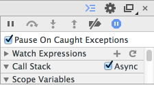

# Chapter.4 - Advanced
在这一章里，我们会基于前面学到的内容，再深入了解一下 Promise 里的一些高级内容，加深对 Promise 的理解。

## 4.1. Promise 的实现类库（Library）
在本小节里，我们将不打算对浏览器实现的 Promise 进行说明，而是要介绍一些第三方实现的和 Promise 兼容的类库。

### 4.1.1. 为什么需要这些类库？
为什么需要这些类库呢？我想有些读者不免会有此疑问。首先能想到的原因是有些运行环境并不支持 [ES6 Promises](http://liubin.github.io/promises-book/#es6-promises) 。


当我们在网上查找 Promise 的实现类库的时候，有一个因素是首先要考虑的，那就是是否具有 [Promises/A+兼容性](http://liubin.github.io/promises-book/#promises-aplus) 。

[Promises/A+](http://liubin.github.io/promises-book/#promises-aplus) 是 [ES6 Promises](http://liubin.github.io/promises-book/#es6-promises) 的前身，Promise 的 `then` 也是来自于此的基于社区的规范。

如果说一个类库兼容 Promises/A+ 的话，那么就是说它除了具有标准的 `then` 方法之外，很多情况下也说明此类库还支持 `Promise.all` 和 `catch` 等功能。

但是 Promises/A+ 实际上只是定义了关于 `Promise#then` 的规范，所以有些类库可能实现了其它诸如 `all` 或 `catch` 等功能，但是可能名字却不一样。

如果我们说一个类库具有 `then` 兼容性的话，实际上指的是 [Thenable](http://liubin.github.io/promises-book/#Thenable) ，它通过使用 [Promise.resolve](http://liubin.github.io/promises-book/#Promise.resolve) 基于 ES6 Promise 的规定，进行 promise 对象的变换。

> ES6 Promise 里关于 promise 对象的规定包括在使用 `catch` 方法，或使用 `Promise.all` 进行处理的时候不能出现错误。

### 4.1.2. Polyfill和扩展类库
在这些 Promise 的实现类库中，我们这里主要对两种类型的类库进行介绍。

一种是被称为 Polyfill （这是一款英国产品，就是装修刮墙用的腻子，其意义可想而知 — 译者注）的类库，另一种是即具有 [Promises/A+兼容性](http://liubin.github.io/promises-book/#promises-aplus) ，又增加了自己独特功能的类库。

> Promise 的实现类库数量非常之多，这里我们只是介绍了其中有限的几个。

**Polyfill**

只需要在浏览器中加载 Polyfill 类库，就能使用 IE10 等或者还没有提供对 Promise 支持的浏览器中使用 Promise 里规定的方法。

也就是说如果加载了 Polyfill 类库，就能在还不支持 Promise 的环境中，运行本文中的各种示例代码。

[jakearchibald/es6-promise](https://github.com/jakearchibald/es6-promise)  
一个兼容 ES6 Promises 的 Polyfill 类库。 它基于 [RSVP.js](https://github.com/tildeio/rsvp.js) 这个兼容 Promises/A+ 的类库， 它只是 RSVP.js 的一个子集，只实现了 Promises 规定的 API。

[yahoo/ypromise](https://github.com/yahoo/ypromise)  
这是一个独立版本的 [YUI](http://yuilibrary.com/) 的 Promise Polyfill，具有和 ES6 Promises 的兼容性。 本书的示例代码也都是基于这个 ypromise 的 Polyfill 来在线运行的。

[getify/native-promise-only](https://github.com/getify/native-promise-only/)  
以作为 ES6 Promises 的 polyfill 为目的的类库 它严格按照 ES6 Promises 的规范设计，没有添加在规范中没有定义的功能。 如果运行环境有原生的 Promise 支持的话，则优先使用原生的 Promise 支持。

**Promise 扩展类库**

Promise 扩展类库除了实现了 Promise 中定义的规范之外，还增加了自己独自定义的功能。

Promise 扩展类库数量非常的多，我们只介绍其中两个比较有名的类库。

[kriskowal/q](https://github.com/kriskowal/q)
类库 `Q` 实现了 Promises 和 Deferreds 等规范。 它自 2009 年开始开发，还提供了面向 Node.js 的文件 IO API [Q-IO](https://github.com/kriskowal/q-io) 等， 是一个在很多场景下都能用得到的类库。

[petkaantonov/bluebird](https://github.com/petkaantonov/bluebird)
这个类库除了兼容 Promise 规范之外，还扩展了取消 promise 对象的运行，取得 promise 的运行进度，以及错误处理的扩展检测等非常丰富的功能，此外它在实现上还在性能问题下了很大的功夫。

Q 和 Bluebird 这两个类库除了都能在浏览器里运行之外，充实的 API reference 也是其特征。  

- [API Reference · kriskowal/q Wiki](https://github.com/kriskowal/q/wiki/API-Reference)   

Q 等文档里详细介绍了 Q 的 Deferred 和 jQuery 里的 Deferred 有哪些异同，以及要怎么进行迁移 Coming from jQuery 等都进行了详细的说明。

- [bluebird/API.md at master · petkaantonov/bluebird
](https://github.com/petkaantonov/bluebird/blob/master/API.md)

Bluebird 的文档除了提供了使用 Promise 丰富的实现方式之外，还涉及到了在出现错误时的对应方法以及 Promise 中的反模式 等内容。

这两个类库的文档写得都很友好，即使我们不使用这两个类库，阅读一下它们的文档也具有一定的参考价值。

###  4.1.3. 总结

本小节介绍了 Promise 的实现类库中的 Polyfill 和扩展类库这两种。

Promise 的实现类库种类繁多，到底选择哪个来使用完全看自己的喜好了。

但是由于这些类库实现的 Promise 同时具有 Promises/A+ 或 ES6 Promises 共通的接口，所以在使用某一类库的时候，有时候也可以参考一下其他类库的代码或者扩展功能。

熟练掌握 Promise 中的共通概念，进而能在实际中能对这些技术运用自如，这也是本书的写作目的之一。

## 4.2. Promise.resolve 和 Thenable

在 第二章的 [Promise.resolve](http://liubin.github.io/promises-book/#ch2-promise-resolve) 中我们已经说过， `Promise.resolve` 的最大特征之一就是可以将 thenable 的对象转换为 promise 对象。

在本小节里，我们将学习一下利用将 thenable 对象转换为 promise 对象这个功能都能具体做些什么事情。

### 4.2.1. 将 Web Notifications 转换为 thenable 对象

这里我们以桌面通知 API [Web Notifications](https://developer.mozilla.org/ja/docs/Web/API/notification) 为例进行说明。

关于 Web Notifications API 的详细信息可以参考下面的网址。

- [使用 Web Notifications - WebAPI | MDN](https://developer.mozilla.org/zh-TW/docs/WebAPI/Using_Web_Notifications)

- [Can I use Web Notifications](http://caniuse.com/notifications)

简单来说，Web Notifications API 就是能像以下代码那样通过 `new Notification` 来显示通知消息。

```

    new Notification("Hi!");

```

当然，为了显示通知消息，我们需要在运行 new Notification 之前，先获得用户的许可。


Figure 11. 确认是否允许 Notification 的对话框

用户在这个是否允许 Notification 的对话框选择后的结果，会通过 Notification.permission 传给我们的程序，它的值可能是允许("granted")或拒绝("denied")这二者之一。

> 否允许 Notification 对话框中的可选项，在 Firefox 中除了允许、拒绝之外，还增加了 *永久有效* 和 *会话范围内有效* 两种额外选项，当然 `Notification.permission` 的值都是一样的。

在程序中可以通过 `Notification.requestPermission()` 来弹出是否允许 Notification 对话框， 用户选择的结果会通过 `status` 参数传给回调函数。

从这个回调函数我们也可以看出来，用户选择允许还是拒绝通知是异步进行的。

```

    Notification.requestPermission(function (status) {
        // status的值为 "granted" 或 "denied"
        console.log(status);
    });

```

到用户收到并显示通知为止，整体的处理流程如下所示。

- 显示是否允许通知的对话框，并异步处理用户选择结果
- 如果用户允许的话，则通过 `new Notification` 显示通知消息。这又分两种情况
 - 用户之前已经允许过
 - 当场弹出是否允许桌面通知对话框
- 当用户不允许的时候，不执行任何操作

虽然上面说到了几种情景，但是最终结果就是用户允许或者拒绝，可以总结为如下两种模式。

**允许时("granted")**
使用 `new Notification` 创建通知消息

**拒绝时("denied")**
没有任何操作

这两种模式是不是觉得有在哪里看过的感觉？ 呵呵，用户的选择结果，正和在 Promise 中 promise 对象变为 Fulfilled 或 Rejected 状态非常类似。

**resolve(成功)时 == 用户允许("granted")**
调用 `onFulfilled` 方法

**reject(失败)时 == 用户拒绝("denied")**
调用 `onRejected` 函数

是不是我们可以用 Promise 的方式去编写桌面通知的代码呢？我们先从回调函数风格的代码入手看看到底怎么去做。

### 4.2.2. Web Notification 包装函数（wrapper）

首先，我们以回到函数风格的代码对上面的 Web Notification API 包装函数进行重写，新代码如下所示。

```

    function notifyMessage(message, options, callback) {
    if (Notification && Notification.permission === 'granted') {
    var notification = new Notification(message, options);
    callback(null, notification);
    } else if (Notification.requestPermission) {
    Notification.requestPermission(function (status) {
    if (Notification.permission !== status) {
    Notification.permission = status;
    }
    if (status === 'granted') {
    var notification = new Notification(message, options);
    callback(null, notification);
    } else {
    callback(new Error('user denied'));
    }
    });
    } else {
    callback(new Error('doesn\'t support Notification API'));
    }
    }
    // 运行实例
    // 第二个参数是传给 `Notification` 的option对象
    notifyMessage("Hi!", {}, function (error, notification) {
    if(error){
    return console.error(error);
    }
    console.log(notification);// 通知对象
    });

```

在回调风格的代码里，当用户拒绝接收通知的时候， `error` 会被设置值，而如果用户同意接收通知的时候，则会显示通知消息并且 `notification` 会被设置值。

**回调函数接收 error 和 notification 两个参数**

```

    function callback(error, notification){

    }

```

下面，我想再将这个回调函数风格的代码使用 Promise 进行改写。

基于上述回调风格的 `notifyMessage` 函数，我们再来创建一个返回 promise 对象的 `notifyMessageAsPromise` 方法。

```

    function notifyMessage(message, options, callback) {
    if (Notification && Notification.permission === 'granted') {
    var notification = new Notification(message, options);
    callback(null, notification);
    } else if (Notification.requestPermission) {
    Notification.requestPermission(function (status) {
    if (Notification.permission !== status) {
    Notification.permission = status;
    }
    if (status === 'granted') {
    var notification = new Notification(message, options);
    callback(null, notification);
    } else {
    callback(new Error('user denied'));
    }
    });
    } else {
    callback(new Error('doesn\'t support Notification API'));
    }
    }
    function notifyMessageAsPromise(message, options) {
    return new Promise(function (resolve, reject) {
    notifyMessage(message, options, function (error, notification) {
    if (error) {
    reject(error);
    } else {
    resolve(notification);
    }
    });
    });
    }
    // 运行示例
    notifyMessageAsPromise("Hi!").then(function (notification) {
    console.log(notification);// 通知对象
    }).catch(function(error){
    console.error(error);
    });

```

在用户允许接收通知的时候，运行上面的代码，会显示 `"Hi!"` 消息。

当用户接收通知消息的时候， `.then` 函数会被调用，当用户拒绝接收消息的时候， `.catch` 方法会被调用。

> 由于浏览器是以网站为单位保存 Web Notifications API 的许可状态的，所以实际上有下面四种模式存在。   

> 已经获得用户许可
`  .then` 方法被调用

> 弹出询问对话框并获得许可
`  .then` 方法被调用

> 已经是被用户拒绝的状态
`  .catch` 方法被调用

> 弹出询问对话框并被用户拒绝
`   .catch` 方法被调用

> 也就是说，如果使用原生的 Web Notifications API 的话，那么需要在程序中对上述四种情况都进行处理，我们可以像下面的包装函数那样，将上述四种情况简化为两种以方便处理。

   ----------


上面的 [notification-as-promise.js](http://liubin.github.io/promises-book/#notification-as-promise.js) 虽然看上去很方便，但是实际上使用的时候，很可能出现 **在不支持 Promise 的环境下不能使用** 的问题。

如果你想编写像 [notification-as-promise.js](http://liubin.github.io/promises-book/#notification-as-promise.js) 这样具有 Promise 风格和的类库的话，我觉得你有如下的一些选择。

**支持Promise的环境是前提**  
- 需要最终用户保证支持 `Promise`  
- 在不支持 `Promise` 的环境下不能正常工作（即应该出错）。

**在类库中实现Promise**  
- 在类库中实现 `Promise` 功能  
- 例如） [localForage](https://github.com/mozilla/localForage)

**在回调函数中也应该能够使用 Promise**  
- 用户可以选择合适的使用方式  
- 返回 Thenable 类型

[notification-as-promise.js](http://liubin.github.io/promises-book/#notification-as-promise.js) 就是以 `Promise` 存在为前提的写法。

回归正文，在这里 Thenable 是为了帮助实现**在回调函数中也能使用** `Promise` 的一个概念。

### 4.2.4. Web Notifications As Thenable

我们已经说过，[thenable](http://liubin.github.io/promises-book/#Thenable) 就是一个具有` .then` 方法的一个对象。下面我们就在 [notification-callback.js](http://liubin.github.io/promises-book/#notification-callback.js) 中增加一个返回值为 `thenable` 类型的方法

```

    function notifyMessage(message, options, callback) {
    if (Notification && Notification.permission === 'granted') {
    var notification = new Notification(message, options);
    callback(null, notification);
    } else if (Notification.requestPermission) {
    Notification.requestPermission(function (status) {
    if (Notification.permission !== status) {
    Notification.permission = status;
    }
    if (status === 'granted') {
    var notification = new Notification(message, options);
    callback(null, notification);
    } else {
    callback(new Error('user denied'));
    }
    });
    } else {
    callback(new Error('doesn\'t support Notification API'));
    }
    }
    // 返回 `thenable`
    function notifyMessageAsThenable(message, options) {
    return {
    'then': function (resolve, reject) {
    notifyMessage(message, options, function (error, notification) {
    if (error) {
    reject(error);
    } else {
    resolve(notification);
    }
    });
    }
    };
    }
    // 运行示例
    Promise.resolve(notifyMessageAsThenable("message")).then(function (notification) {
    console.log(notification);// 通知对象
    }).catch(function(error){
    console.error(error);
    });
 
```

[notification-thenable.js](http://liubin.github.io/promises-book/#notification-thenable.js) 里增加了一个 `notifyMessageAsThenable` 方法。这个方法返回的对象具备一个 `then` 方法。

`then` 方法的参数和 `new Promise(function (resolve, reject){})` 一样，在确定时执行 `resolve` 方法，拒绝时调用 `reject` 方法。

`then` 方法和 [notification-as-promise.js](http://liubin.github.io/promises-book/#notification-thenable.js) 中的 `notifyMessageAsPromise` 方法完成了同样的工作。

我们可以看出， `Promise.resolve(thenable)` 通过使用了  `thenable` 这个promise对象，就能利用 Promise 功能了。

```

    Promise.resolve(notifyMessageAsThenable("message")).then(function (notification) {
        console.log(notification);// 通知对象
    }).catch(function(error){
        console.error(error);
    });

```

使用了 Thenable 的[ notification-thenable.js](http://liubin.github.io/promises-book/#notification-thenable.js) 和依赖于 Promise 的 [notification-as-promise.js](http://liubin.github.io/promises-book/#notification-as-promise.js) ，实际上都是非常相似的使用方法。

[notification-thenable.js](http://liubin.github.io/promises-book/#notification-thenable.js) 和 [notification-as-promise.js](http://liubin.github.io/promises-book/#notification-as-promise.js) 比起来，有以下的不同点。

- 类库侧没有提供 Promise 的实现
 - 用户通过 `Promise.resolve(thenable)` 来自己实现了 Promise

- 作为 Promise 使用的时候，需要和 `Promise.resolve(thenable)` 一起配合使用

### 4.2.5. 总结

在本小节我们主要学习了什么是 Thenable，以及如何通过 `Promise.resolve(thenable)` 使用 Thenable，将其作为 promise 对象来使用。

Callback — Thenable — Promise

Thenable 风格表现为位于回调和 Promise 风格中间的一种状态，作为类库的公开 API 有点不太成熟，所以并不常见。

Thenable 本身并不依赖于 Promise 功能，但是 Promise 之外也没有使用 Thenable 的方式，所以可以认为 Thenable 间接依赖于 Promise。

另外，用户需要对 `Promise.resolve(thenable)` 有所理解才能使用好 Thenable，因此作为类库的公开 API 有一部分会比较难。和公开 API 相比，更多情况下是在内部使用 Thenable。

>在编写异步处理的类库的时候，推荐采用先编写回调风格的函数，然后再转换为公开 API 这种方式。

>貌似 Node.js 的 Core module 就采用了这种方式，除了类库提供的基本回调风格的函数之外，用户也可以通过 Promise 或者 Generator 等自己擅长的方式进行实现。

>最初就是以能被 Promise 使用为目的的类库，或者其本身依赖于 Promise 等情况下，我想将返回 promise 对象的函数作为公开 API 应该也没什么问题。

**什么时候该使用 Thenable？**

那么，又是在什么情况下应该使用 Thenable 呢？

恐怕最可能被使用的是在 [Promise 类库](http://liubin.github.io/promises-book/#promise-library) 之间进行相互转换了。

比如，类库 Q 的 Promise 实例为 Q promise对象，提供了 [ES6 Promises](http://liubin.github.io/promises-book/#es6-promises) 的 promise 对象不具备的方法。Q promise 对象提供了 `promise.finally(callback)` 和 `promise.nodeify(callback)` 等方法。

如果你想将 ES6 Promises 的 promise 对象转换为 Q promise 的对象，轮到 Thenable 大显身手的时候就到了。

**使用 thenable 将 promise 对象转换为 Q promise 对象**

```

    var Q = require("Q");
    // 这是一个ES6的promise对象
    var promise = new Promise(function(resolve){
        resolve(1);
    });
    // 变换为Q promise对象
    Q(promise).then(function(value){
        console.log(value);
    }).finally(function(){ <1>
        console.log("finally");
    });

```

<1> 因为是 Q promise对象所以可以使用 `finally` 方法

上面代码中最开始被创建的 promise 对象具备 `then` 方法，因此是一个 Thenable 对象。我们可以通过 `Q(thenable)`方法，将这个 Thenable 对象转换为 Q promise 对象。

可以说它的机制和 `Promise.resolve(thenable)` 一样，当然反过来也一样。

像这样，Promise 类库虽然都有自己类型的 promise 对象，但是它们之间可以通过 Thenable 这个共通概念，在类库之间（当然也包括 native Promise）进行 promise 对象的相互转换。

我们看到，就像上面那样，Thenable 多在类库内部实现中使用，所以从外部来说不会经常看到 Thenable 的使用。但是我们必须牢记 Thenable 是 Promise 中一个非常重要的概念。

## 4.3. 使用 reject 而不是 throw

Promise 的构造函数，以及被 then 调用执行的函数基本上都可以认为是在 try...catch 代码块中执行的，所以在这些代码中即使使用 throw ，程序本身也不会因为异常而终止。

如果在 Promise 中使用 throw 语句的话，会被 try...catch 住，最终 promise 对象也变为 Rejected 状态。

```

     var promise = new Promise(function(resolve, reject){
      throw new Error("message");
    });
    promise.catch(function(error){
        console.error(error);// => "message"
    });

```[http://liubin.github.io/promises-book/#promise-states](http://liubin.github.io/promises-book/#promise-states)
代码像这样其实运行时倒也不会有什么问题，但是如果想把 promise 对象状态 设置为 Rejected 状态的话，使用 `reject` 方法则更显得合理。

所以上面的代码可以改写为下面这样。

```

    var promise = new Promise(function(resolve, reject){
        reject(new Error("message"));
    });
    promise.catch(function(error){
        console.error(error);// => "message"
    })

```

其实我们也可以这么来考虑，在出错的时候我们并没有调用 `throw` 方法，而是使用了 `reject` ，那么给 `reject` 方法传递一个 Error 类型的对象也就很好理解了。

### 4.3.1. 使用reject有什么优点？

话说回来，为什么在想将 promise 对象的状态设置为 Rejected 的时候应该使用 `reject` 而不是 `throw` 呢？

首先是因为我们很难区分 `throw` 是我们主动抛出来的，还是因为真正的其它 **异常 **导致的。

比如在使用 Chrome 浏览器的时候，Chrome 的开发者工具提供了在程序发生异常的时候自动在调试器中 break 的功能。



Figure 12. Pause On Caught Exceptions

当我们开启这个功能的时候，在执行到下面代码中的 `throw` 时就会触发调试器的 break 行为。

```

    var promise = new Promise(function(resolve, reject){
        throw new Error("message");
    });

```

本来这是和调试没有关系的地方，也因为在 Promise 中的 `throw` 语句被 break 了，这也严重的影响了浏览器提供的此功能的正常使用。

### 4.3.2. 在 then 中进行 reject
在 Promise 构造函数中，有一个用来指定 reject 方法的参数，使用这个参数而不是依靠 `throw` 将 promise 对象的状态设置为 Rejected 状态非常简单。

那么如果像下面那样想在 `then` 中进行 reject 的话该怎么办呢？
    
```


     var promise = Promise.resolve();
    promise.then(function (value) {
        setTimeout(function () {
        // 经过一段时间后还没处理完的话就进行reject - 2
        }, 1000);
        // 比较耗时的处理 - 1
        somethingHardWork();
    }).catch(function (error) {
        // 超时错误 - 3
    });

```

上面的超时处理，需要在 `then` 中进行 `reject` 方法调用，但是传递给当前的回调函数的参数只有前面的一 promise 对象，这该怎么办呢？

> 关于使用 Promise 进行超时处理的具体实现方法可以参考 [使用 Promise.race 和 delay 取消 XHR 请求](http://liubin.github.io/promises-book/#race-delay-timeout) 中的详细说明。

在这里我们再次回忆下 `then` 的工作原理。

在 `then` 中注册的回调函数可以通过 `return` 返回一个值，这个返回值会传给后面的 `then` 或 `catch` 中的回调函数。

而且 `return` 的返回值类型不光是简单的字面值，还可以是复杂的对象类型，比如 promise 对象等。

这时候，如果返回的是 promise 对象的话，那么根据这个 promise 对象的状态，在下一个 `then` 中注册的回调函数中的 onFulfilled 和 onRejected 的哪一个会被调用也是能确定的。

```

    var promise = Promise.resolve();
    promise.then(function () {
    var retPromise = new Promise(function (resolve, reject) {
        // resolve or reject 的状态决定 onFulfilled or onRejected 的哪个方法会被调用
    });
        return retPromise;<1>
    }).then(onFulfilled, onRejected);

```

<1> 后面的 then 调用哪个回调函数是由 promise 对象的状态来决定的

也就是说，这个 `retPromise` 对象状态为 `Rejected` 的时候，会调用后面 `then` 中的 `onRejected` 方法，这样就实现了即使在 `then` 中不使用 `throw` 也能进行 reject 处理了。

```

    ar onRejected = console.error.bind(console);
    var promise = Promise.resolve();
    promise.then(function () {
    var retPromise = new Promise(function (resolve, reject) {
       reject(new Error("this promise is rejected"));
    });
    return retPromise;
    }).catch(onRejected);


```

使用 [Promise.reject](http://liubin.github.io/promises-book/#Promise.reject) 的话还能再将代码进行简化。

```

    var onRejected = console.error.bind(console);
    var promise = Promise.resolve();
    promise.then(function () {
        return Promise.reject(new Error("this promise is rejected"));
    }).catch(onRejected);

```

### 4.3.3. 总结

在本小节我们主要学习了

- 使用 `reject` 会比使用 `throw` 安全

- 在 `then` 中使用 `reject` 的方法

也许实际中我们可能不常使用 `rejec`t ，但是比起来不假思索的使用 `throw` 来说，使用 `reject` 的好处还是很多的。

关于上面讲的内容的比较详细的例子，大家可以参考在 [使用 Promise.race 和 delay 取消 XHR 请求](http://liubin.github.io/promises-book/#race-delay-timeout) 小节的介绍。

## 4.4. Deferred 和 Promise

这一节我们来简单介绍下 Deferred 和 Promise 之间的关系

### 4.4.1. 什么是 Deferred？

说起 Promise ，我想大家一定同时也听说过 Deferred 这个术语。比如 [jQuery.Deferred](http://api.jquery.com/category/deferred-object/) 和 [JSDeferred](http://cho45.stfuawsc.com/jsdeferred/) 等，一定都是大家非常熟悉的内容了。

Deferred 和 Promise不同，它没有共通的规范，每个 Library 都是根据自己的喜好来实现的。

在这里，我们打算以 [jQuery.Deferred](http://api.jquery.com/category/deferred-object/) 类似的实现为中心进行介绍。

### 4.4.2. Deferred 和Promise 的关系

简单来说，Deferred 和 Promise 具有如下的关系。

- Deferred 拥有 Promise

- Deferred 具备对 Promise 的状态进行操作的特权方法（图中的"特権メソッド"）


Figure 13. Deferred和Promise

我想各位看到此图应该就很容易理解了，Deferred 和 Promise 并不是处于竞争的关系，而是 Deferred 内涵了 Promise。

> 这是 jQuery.Deferred 结构的简化版。当然也有的 Deferred 实现并没有内涵 Promise。

光看图的话也许还难以理解，下面我们就看看看怎么通过 Promise 来实现 Deferred。

### 4.4.3. Deferred top on Promise

基于 Promise 实现 Deferred 的例子。

```

    function Deferred() {
    this.promise = new Promise(function (resolve, reject) {
    this._resolve = resolve;
    this._reject = reject;
    }.bind(this));
    }
    Deferred.prototype.resolve = function (value) {
    this._resolve.call(this.promise, value);
    };
    Deferred.prototype.reject = function (reason) {
    this._reject.call(this.promise, reason);
    };

```

我们再将之前使用 Promise 实现的 getURL 用 Deferred 改写一下。

```


    function Deferred() {
    this.promise = new Promise(function (resolve, reject) {
    this._resolve = resolve;
    this._reject = reject;
    }.bind(this));
    }
    Deferred.prototype.resolve = function (value) {
    this._resolve.call(this.promise, value);
    };
    Deferred.prototype.reject = function (reason) {
    this._reject.call(this.promise, reason);
    };
    function getURL(URL) {
    var deferred = new Deferred();
    var req = new XMLHttpRequest();
    req.open('GET', URL, true);
    req.onload = function () {
    if (req.status === 200) {
    deferred.resolve(req.responseText);
    } else {
    deferred.reject(new Error(req.statusText));
    }
    };
    req.onerror = function () {
    deferred.reject(new Error(req.statusText));
    };
    req.send();
    return deferred.promise;
    }
    // 运行示例
    var URL = "http://httpbin.org/get";
    getURL(URL).then(function onFulfilled(value){
    console.log(value);
    }).catch(console.error.bind(console));

```

所谓的能对 Promise 状态进行操作的特权方法，指的就是能对 promise 对象的状态进行 resolve、reject 等调用的方法，而通常的 Promise 的话只能在通过构造函数传递的方法之内对 promise 对象的状态进行操作。

我们来看看 Deferred 和 Promise 相比在实现上有什么异同。

```


    function getURL(URL) {
    return new Promise(function (resolve, reject) {
    var req = new XMLHttpRequest();
    req.open('GET', URL, true);
    req.onload = function () {
    if (req.status === 200) {
    resolve(req.responseText);
    } else {
    reject(new Error(req.statusText));
    }
    };
    req.onerror = function () {
    reject(new Error(req.statusText));
    };
    req.send();
    });
    }
    // 运行示例
    var URL = "http://httpbin.org/get";
    getURL(URL).then(function onFulfilled(value){
    console.log(value);
    }).catch(console.error.bind(console));

```

对比上述两个版本的 `getURL` ，我们发现它们有如下不同。

- Deferred 的话不需要将代码用 Promise 括起来

 - 由于没有被嵌套在函数中，可以减少一层缩进
 - 反过来没有 Promise 里的错误处理逻辑

在以下方面，它们则完成了同样的工作。

- 整体处理流程
 - 调用 `resolve、reject` 的时机
 - 函数都返回了 promise 对象

由于 Deferred 包含了 Promise，所以大体的流程还是差不多的，不过 Deferred 有用对 Promise 进行操作的特权方法，以及高度自由的对流程控制进行自由定制。

比如在 Promise 一般都会在构造函数中编写主要处理逻辑，对 `resolve`、`reject` 方法的调用时机也基本是很确定的。

```


    new Promise(function (resolve, reject){
        // 在这里进行promise对象的状态确定
    });

```


而使用 Deferred 的话，并不需要将处理逻辑写成一大块代码，只需要先创建 deferred 对象，可以在任何时机对 `resolve`、`reject` 方法进行调用。

```

    var deferred = new Deferred();

    // 可以在随意的时机对 `resolve`、`reject` 方法进行调用

```


上面我们只是简单的实现了一个 **Deferred** ，我想你已经看到了它和 **Promise** 之间的差异了吧。

如果说 Promise 是用来对值进行抽象的话，Deferred 则是对处理还没有结束的状态或操作进行抽象化的对象，我们也可以从这一层的区别来理解一下这两者之间的差异。

换句话说，Promise 代表了一个对象，这个对象的状态现在还不确定，但是未来一个时间点它的状态要么变为正常值（FulFilled），要么变为异常值（Rejected）；而 Deferred 对象表示了一个处理还没有结束的这种事实，在它的处理结束的时候，可以通过 Promise 来取得处理结果。

如果各位读者还想深入了解一下 Deferred 的话，可以参考下面的这些资料。

- [Promise & Deferred objects in JavaScript Pt.1: Theory and Semantics.](http://blog.mediumequalsmessage.com/promise-deferred-objects-in-javascript-pt1-theory-and-semantics)
- [Twisted 入门 — Twisted Intro](http://skitazaki.appspot.com/translation/twisted-intro-ja/index.html)
- [Promise anti patterns · petkaantonov/bluebird Wiki](https://github.com/petkaantonov/bluebird/wiki/Promise-anti-patterns#the-deferred-anti-pattern)
- [Coming from jQuery · kriskowal/q Wiki](https://github.com/kriskowal/q/wiki/Coming-from-jQuery)

> Deferred 最初是在 Python 的 [Twisted](https://twistedmatrix.com/trac/) 框架中被提出来的概念。 在 JavaScript 领域可以认为它是由 [MochiKit.Async](http://mochi.github.io/mochikit/doc/html/MochiKit/Async.html) 、 [dojo/Deferred](http://dojotoolkit.org/reference-guide/1.9/dojo/Deferred.html) 等 Library 引入的。

## 4.5. 使用 Promise.race 和 delay 取消 XHR 请求

在本小节中，作为在第 [2 章](http://liubin.github.io/promises-book/#ch2-promise-race)所学的 `Promise.race` 的具体例子，我们来看一下如何使用 Promise.race 来实现超时机制。

当然 XHR 有一个 [timeout](https://developer.mozilla.org/ja/docs/XMLHttpRequest/Synchronous_and_Asynchronous_Requests) 属性，使用该属性也可以简单实现超时功能，但是为了能支持多个 XHR 同时超时或者其他功能，我们采用了容易理解的异步方式在 XHR 中通过超时来实现取消正在进行中的操作。

### 4.5.1. 让 Promise 等待指定时间

首先我们来看一下如何在 Promise 中实现超时。

所谓超时就是要在经过一定时间后进行某些操作，使用 `setTimeout` 的话很好理解。

首先我们来串讲一个单纯的在 Promise 中调用  `setTimeout` 的函数。

```


    function delayPromise(ms) {
        return new Promise(function (resolve) {
        setTimeout(resolve, ms);
    });
    }

```

`delayPromise(ms)` 返回一个在经过了参数指定的毫秒数后进行 onFulfilled 操作的 promise 对象，这和直接使用 `setTimeout` 函数比较起来只是编码上略有不同，如下所示。

```
    
    setTimeout(function () {
    alert("已经过了100ms！");
    }, 100);
    // == 几乎同样的操作
    delayPromise(100).then(function () {
    alert("已经过了100ms！");
    });

```

在这里 **promise 对象** 这个概念非常重要，请切记。

### 4.5.2. Promise.race 中的超时

让我们回顾一下静态方法 `Promise.race` ，它的作用是在任何一个 promise 对象进入到确定（解决）状态后就继续进行后续处理，如下面的例子所示。

```

    var winnerPromise = new Promise(function (resolve) {
    setTimeout(function () {
    console.log('this is winner');
    resolve('this is winner');
    }, 4);
    });
    var loserPromise = new Promise(function (resolve) {
    setTimeout(function () {
    console.log('this is loser');
    resolve('this is loser');
    }, 1000);
    });
    // 第一个promise变为resolve后程序停止
    Promise.race([winnerPromise, loserPromise]).then(function (value) {
    console.log(value);// => 'this is winner'
    });

```


我们可以将刚才的 [delayPromise](http://liubin.github.io/promises-book/#delayPromise.js) 和其它 promise 对象一起放到 `Promise.race` 中来是实现简单的超时机制。

```


    function delayPromise(ms) {
    return new Promise(function (resolve) {
    setTimeout(resolve, ms);
    });
    }
    function timeoutPromise(promise, ms) {
    var timeout = delayPromise(ms).then(function () {
    throw new Error('Operation timed out after ' + ms + ' ms');
    });
    return Promise.race([promise, timeout]);
    }

```

函数 `timeoutPromise`(比较对象 promise, ms) 接收两个参数，第一个是需要使用超时机制的 promise 对象，第二个参数是超时时间，它返回一个由 `Promise.race` 创建的相互竞争的 promise 对象。

之后我们就可以使用 `timeoutPromise` 编写下面这样的具有超时机制的代码了。

```

    function delayPromise(ms) {
    return new Promise(function (resolve) {
    setTimeout(resolve, ms);
    });
    }
    function timeoutPromise(promise, ms) {
    var timeout = delayPromise(ms).then(function () {
    throw new Error('Operation timed out after ' + ms + ' ms');
    });
    return Promise.race([promise, timeout]);
    }
    // 运行示例
    var taskPromise = new Promise(function(resolve){
    // 随便一些什么处理
    var delay = Math.random() * 2000;
    setTimeout(function(){
    resolve(delay + "ms");
    }, delay);
    });
    timeoutPromise(taskPromise, 1000).then(function(value){
    console.log("taskPromise在规定时间内结束 : " + value);
    }).catch(function(error){
    console.log("发生超时", error);
    });

```


虽然在发生超时的时候抛出了异常，但是这样的话我们就不能区分这个异常到底是普通的错误还是超时错误了。

为了能区分这个 `Error` 对象的类型，我们再来定义一个 `Error` 对象的子类 `TimeoutError`。

### 4.5.3. 定制 Error 对象


`Error` 对象是 ECMAScript 的内建（build in）对象。

但是由于 stack trace 等原因我们不能完美的创建一个继承自 `Error` 的类，不过在这里我们的目的只是为了和 `Error` 有所区别，我们将创建一个 `TimeoutError` 类来实现我们的目的。

> 在 ECMAScript6 中可以使用 class 语法来定义类之间的继承关系。

> class MyError extends Error{
    // 继承了Error类的对象
 }

为了让我们的 `TimeoutErro`r 能支持类似 `error instanceof TimeoutError` 的使用方法，我们还需要进行如下工作。

```


    function copyOwnFrom(target, source) {
    Object.getOwnPropertyNames(source).forEach(function (propName) {
    Object.defineProperty(target, propName, Object.getOwnPropertyDescriptor(source, propName));
    });
    return target;
    }
    function TimeoutError() {
    var superInstance = Error.apply(null, arguments);
    copyOwnFrom(this, superInstance);
    }
    TimeoutError.prototype = Object.create(Error.prototype);
    TimeoutError.prototype.constructor = TimeoutError;

```


我们定义了 `TimeoutError` 类和构造函数，这个类继承了 Error 的 prototype。

它的使用方法和普通的 `Error` 对象一样，使用 `throw` 语句即可，如下所示。

```

    var promise = new Promise(function(){
        throw TimeoutError("timeout");
    });

    promise.catch(function(error){
        console.log(error instanceof TimeoutError);// true
    });

```

有了这个 `TimeoutError` 对象，我们就能很容易区分捕获的到底是因为超时而导致的错误，还是其他原因导致的 Error 对象了。

> 本章里介绍的继承 JavaScript 内建对象的方法可以参考 [Chapter 28. Subclassing Built-ins](http://speakingjs.com/es5/ch28.html) ，那里有详细的说明。此外 [Error - JavaScript | MDN](https://developer.mozilla.org/en-US/docs/Web/JavaScript/Reference/Global_Objects/Error) 也针对 Error 对象进行了详细说明。

### 4.5.4. 通过超时取消 XHR 操作

到这里，我想各位读者都已经对如何使用 Promise 来取消一个 XHR 请求都有一些思路了吧。

取消 XHR 操作本身的话并不难，只需要调用 `XMLHttpRequest` 对象的 `abort()` 方法就可以了。

为了能在外部调用 `abort()` 方法，我们先对之前本节出现的 `getURL` 进行简单的扩展，`cancelableXHR` 方法除了返回一个包装了 XHR 的 promise 对象之外，还返回了一个用于取消该 XHR 请求的 `abort` 方法。

```


    function cancelableXHR(URL) {
    var req = new XMLHttpRequest();
    var promise = new Promise(function (resolve, reject) {
    req.open('GET', URL, true);
    req.onload = function () {
    if (req.status === 200) {
    resolve(req.responseText);
    } else {
    reject(new Error(req.statusText));
    }
    };
    req.onerror = function () {
    reject(new Error(req.statusText));
    };
    req.onabort = function () {
    reject(new Error('abort this request'));
    };
    req.send();
    });
    var abort = function () {
    // 如果request还没有结束的话就执行abort
    // https://developer.mozilla.org/en/docs/Web/API/XMLHttpRequest/Using_XMLHttpRequest
    if (req.readyState !== XMLHttpRequest.UNSENT) {
    req.abort();
    }
    };
    return {
    promise: promise,
    abort: abort
    };
    }

```

在这些问题都明了之后，剩下只需要进行 Promise 处理的流程进行编码即可。大体的流程就像下面这样。

1. 通过 cancelableXHR 方法取得包装了 XHR 的 promise 对象和取消该 XHR 请求的方法

2. 在 `timeoutPromise` 方法中通过 `Promise.race` 让 XHR 的包装 promise 和超时用 promise 进行竞争。

 - XHR 在超时前返回结果的话

   a. 和正常的 promise 一样，通过 `then` 返回请求结果

 - 发生超时的时候

   a. 抛出 `throw TimeoutError` 异常并被 `catch`

   b. `catch` 的错误对象如果是 `TimeoutError` 类型的话，则调用 `abort` 方法取消 XHR 请求
 
将上面的步骤总结一下的话，代码如下所示。

```


    function copyOwnFrom(target, source) {
    Object.getOwnPropertyNames(source).forEach(function (propName) {
    Object.defineProperty(target, propName, Object.getOwnPropertyDescriptor(source, propName));
    });
    return target;
    }
    function TimeoutError() {
    var superInstance = Error.apply(null, arguments);
    copyOwnFrom(this, superInstance);
    }
    TimeoutError.prototype = Object.create(Error.prototype);
    TimeoutError.prototype.constructor = TimeoutError;
    function delayPromise(ms) {
    return new Promise(function (resolve) {
    setTimeout(resolve, ms);
    });
    }
    function timeoutPromise(promise, ms) {
    var timeout = delayPromise(ms).then(function () {
    return Promise.reject(new TimeoutError('Operation timed out after ' + ms + ' ms'));
    });
    return Promise.race([promise, timeout]);
    }
    function cancelableXHR(URL) {
    var req = new XMLHttpRequest();
    var promise = new Promise(function (resolve, reject) {
    req.open('GET', URL, true);
    req.onload = function () {
    if (req.status === 200) {
    resolve(req.responseText);
    } else {
    reject(new Error(req.statusText));
    }
    };
    req.onerror = function () {
    reject(new Error(req.statusText));
    };
    req.onabort = function () {
    reject(new Error('abort this request'));
    };
    req.send();
    });
    var abort = function () {
    // 如果request还没有结束的话就执行abort
    // https://developer.mozilla.org/en/docs/Web/API/XMLHttpRequest/Using_XMLHttpRequest
    if (req.readyState !== XMLHttpRequest.UNSENT) {
    req.abort();
    }
    };
    return {
    promise: promise,
    abort: abort
    };
    }
    var object = cancelableXHR('http://httpbin.org/get');
    // main
    timeoutPromise(object.promise, 1000).then(function (contents) {
    console.log('Contents', contents);
    }).catch(function (error) {
    if (error instanceof TimeoutError) {
    object.abort();
    return console.log(error);
    }
    console.log('XHR Error :', error);
    });

```

上面的代码就通过在一定的时间内变为解决状态的 promise 对象实现了超时处理。

> 通常进行开发的情况下，由于这些逻辑会频繁使用，因此将这些代码分割保存在不同的文件应该是一个不错的选择。

### 4.5.5. promise和操作方法

在前面的 [cancelableXHR](http://liubin.github.io/promises-book/#delay-race-cancel.js) 中，promise 对象及其操作方法都是在一个对象中返回的，看起来稍微有些不太好理解。

从代码组织的角度来说一个函数只返回一个值（promise 对象）是一个非常好的习惯，但是由于在外面不能访问 `cancelableXHR` 方法中创建的 `req` 变量，所以我们需要编写一个专门的函数（上面的例子中的 `abort`）来对这些内部对象进行处理。

当然也可以考虑到对返回的 promise 对象进行扩展，使其支持 `abort` 方法，但是由于 promise 对象是对值进行抽象化的对象，如果不加限制的增加操作用的方法的话，会使整体变得非常复杂。

大家都知道一个函数做太多的工作都不认为是一个好的习惯，因此我们不会让一个函数完成所有功能，也许像下面这样对函数进行分割是一个不错的选择。

- 返回包含 XHR 的 promise 对象

- 接收 promise 对象作为参数并取消该对象中的 XHR 请求

将这些处理整理为一个模块的话，以后扩展起来也方便，一个函数所做的工作也会比较精炼，代码也会更容易阅读和维护。

我们有很多方法来创建一个模块（AMD,CommonJS,ES6 module etc..），在这里，我们将会把前面的 `cancelableXHR` 整理为一个 Node.js 的模块使用。

```


    "use strict";
    var requestMap = {};
    function createXHRPromise(URL) {
    var req = new XMLHttpRequest();
    var promise = new Promise(function (resolve, reject) {
    req.open('GET', URL, true);
    req.onreadystatechange = function () {
    if (req.readyState === XMLHttpRequest.DONE) {
    delete requestMap[URL];
    }
    };
    req.onload = function () {
    if (req.status === 200) {
    resolve(req.responseText);
    } else {
    reject(new Error(req.statusText));
    }
    };
    req.onerror = function () {
    reject(new Error(req.statusText));
    };
    req.onabort = function () {
    reject(new Error('abort this req'));
    };
    req.send();
    });
    requestMap[URL] = {
    promise: promise,
    request: req
    };
    return promise;
    }
    
    function abortPromise(promise) {
    if (typeof promise === "undefined") {
    return;
    }
    var request;
    Object.keys(requestMap).some(function (URL) {
    if (requestMap[URL].promise === promise) {
    request = requestMap[URL].request;
    return true;
    }
    });
    if (request != null && request.readyState !== XMLHttpRequest.UNSENT) {
    request.abort();
    }
    }
    module.exports.createXHRPromise = createXHRPromise;
    module.exports.abortPromise = abortPromise;

```

使用方法也非常简单，我们通过 `createXHRPromise` 方法得到 XHR 的 promise 对象，当想对这个 XHR 进行 `abort` 操作的时候，将这个 promise 对象传递给  `abortPromise(promise)` 方法就可以了。

```

    var cancelableXHR = require("./cancelableXHR");

    var xhrPromise = cancelableXHR.createXHRPromise('http://httpbin.org/get');<1>
    xhrPromise.catch(function (error) {
        // 调用 abort 抛出的错误
    });
    cancelableXHR.abortPromise(xhrPromise);<2>

```

<1> 创建包装了 XHR 的 promise 对象
<2> 取消在 1 中创建的 promise 对象的请求操作

### 4.5.6. 总结

在这里我们学到了如下内容。

- 经过一定时间后变为解决状态的 delayPromise
 
- 基于 delayPromise 和 Promise.race 的超时实现方式

- 取消 XHR promise 请求

- 通过模块化实现 promise 对象和操作的分离

Promise 能非常灵活的进行处理流程的控制，为了充分发挥它的能力，我们需要注意不要将一个函数写的过于庞大冗长，而是应该将其分割成更小更简单的处理，并对之前 JavaScript 中提到的机制进行更深入的了解。

## 4.6. 什么是 Promise.prototype.done ？

如果你使用过其他的 Promise 实现类库的话，可能见过用 `done` 代替 `then` 的例子。

这些类库都提供了 `Promise.prototype.done` 方法，使用起来也和 `then` 一样，但是这个方法并不会返回 promise 对象。

虽然 [ES6 Promises](http://liubin.github.io/promises-book/#es6-promises) 和 [Promises/A+](http://liubin.github.io/promises-book/#promises-aplus) 等在设计上并没有对 `Promise.prototype.done` 做出任何规定，但是很多实现类库都提供了该方法的实现。

在本小节中，我们将会学习什么是 `Promise.prototype.done` ，以及为什么很多类库都提供了对该方法的支持。

### 4.6.1. 使用 done 的代码示例

看一下实际使用 `done` 的代码的例子的话，应该就非常容易理解 `done` 方法的行为了。

```


    if (typeof Promise.prototype.done === 'undefined') {
    Promise.prototype.done = function (onFulfilled, onRejected) {
    this.then(onFulfilled, onRejected).catch(function (error) {
    setTimeout(function () {
    throw error;
    }, 0);
    });
    };
    }
    var promise = Promise.resolve();
    promise.done(function () {
    JSON.parse('this is not json');// => SyntaxError: JSON.parse
    });
    // => 请打开浏览器的开发者工具中的控制台窗口看一下

```


在前面我们已经说过，promise 设计规格并没有对 `Promise.prototype.done` 做出任何规定，因此在使用的时候，你可以使用已有类库提供的实现，也可以自己去实现。

我们会在后面讲述如何去自己实现，首先我们这里先对使用 `then` 和使用 `done` 这两种方式进行一下比较。

**使用 then 的场景**

```

    var promise = Promise.resolve();
    promise.then(function () {
    JSON.parse("this is not json");
    }).catch(function (error) {
    console.error(error);// => "SyntaxError: JSON.parse"
    });

```

从上面我们可以看出，两者之间有以下不同点。

- `done` 并不返回 promise 对象

 - 也就是说，在 `done` 之后不能使用 `catch` 等方法组成方法链

- `done` 中发生的异常会被直接抛给外面

 - 也就是说，不会进行 Promise 的错误处理（Error Handling）

由于 `done` 不会返回 promise 对象，所以我们不难理解它只能出现在一个方法链的最后。

此外，我们已经介绍过了 Promise 具有强大的错误处理机制，而 `done` 则会在函数中跳过错误处理，直接抛出异常。

为什么很多类库都提供了这个和 Promise 功能相矛盾的函数呢？看一下下面 Promise 处理失败的例子，也许我们多少就能理解其中原因了吧。

### 4.6.2. 消失的错误

Promise 虽然具备了强大的错误处理机制，但是（调试工具不能顺利运行的时候）这个功能会导致人为错误（human error）更加复杂，这也是它的一个缺点。

也许你还记得，我们在 [then or catch](http://liubin.github.io/promises-book/#then-or-catch)? 中也看到了类似的内容。

像下面那样，我们看一个能返回 promise 对象的函数。


```

    function JSONPromise(value) {
    return new Promise(function (resolve) {
    resolve(JSON.parse(value));
    });
    }

```

这个函数将接收到的参数传递给 `JSON.parse` ，并返回一个基于 `JSON.parse` 的 promise 对象。

我们可以像下面那样使用这个 Promise 函数，由于 `JSON.parse` 会解析失败并抛出一个异常，该异常会被 `catch` 捕获。

```
    function JSONPromise(value) {
    return new Promise(function (resolve) {
    resolve(JSON.parse(value));
    });
    }
    // 运行示例
    var string = "非合法json编码字符串";
    JSONPromise(string).then(function (object) {
    console.log(object);
    }).catch(function(error){
    // => JSON.parse抛出异常时
    console.error(error);
    });
```


如果这个解析失败的异常被正常捕获的话则没什么问题，但是如果编码时忘记了处理该异常，一旦出现异常，那么查找异常发生的源头将会变得非常棘手，这就是使用 promise 需要注意的一面。

**忘记了使用 catch 进行异常处理的的例子**
```

    var string = "非合法json编码字符串";
    JSONPromise(string).then(function (object) {
        console.log(object);
    }); <1>

```

<1>虽然抛出了异常，但是没有对该异常进行处理

如果是 `JSON.parse` 这样比较好找的例子还算好说，如果是拼写错误的话，那么发生了 Syntax Error 错误的话将会非常麻烦。

**typo错误**

```

    var string = "{}";
    JSONPromise(string).then(function (object) {
        conosle.log(object);<1>
    });

```
<1>存在 conosle 这个拼写错误

这这个例子里，我们错把 `console` 拼成了 `conosle` ，因此会发生如下错误。

```

    ReferenceError: conosle is not defined
```

但是，由于 Promise 的 try-catch 机制，这个问题可能会被内部消化掉。 如果在调用的时候每次都无遗漏的进行 `catch` 处理的话当然最好了，但是如果在实现的过程中出现了这个例子中的错误的话，那么进行错误排除的工作也会变得困难。

这种错误被内部消化的问题也被称为 *unhandled rejection* ，从字面上看就是在 Rejected 时没有找到相应处理的意思。

> 这种 unhandled rejection 错误到底有多难检查，也依赖于 Promise 的实现。 比如 ypromise 在检测到 unhandled rejection 错误的时候，会在控制台上提示相应的信息。

> Promise rejected but no error handlers were registered to it
另外， [Bluebird 在比较明显的人为错误，即 ReferenceError 等错误的时候，会直接显示到控制台上](https://github.com/petkaantonov/bluebird)。

> "Possibly unhandled ReferenceError. conosle is not defined

> 原生（Native）的 Promise 实现为了应对同样问题，提供了 GC-based unhandled rejection tracking 功能。

> 该功能是在 promise 对象被垃圾回收器回收的时候，如果是 unhandled rejection 的话，则进行错误显示的一种机制。[Firefox](https://twitter.com/domenic/status/461154989856264192) 或 [Chrome](https://code.google.com/p/v8/issues/detail?id=3093) 的原生 Promise 都进行了部分实现。

### 4.6.3. done 的实现

作为方法论，在 Promise 中 `done` 是怎么解决上面提到的错误被忽略呢？ 其实它的方法很简单直接，那就是必须要进行错误处理。

由于可以在 Promise 上实现 `done` 方法，因此我们看看如何对 `Promise.prototype.done` 这个 Promise 的 prototype 进行扩展。

```

    promise-prototype-done.js
    "use strict";
    if (typeof Promise.prototype.done === "undefined") {
    Promise.prototype.done = function (onFulfilled, onRejected) {
    this.then(onFulfilled, onRejected).catch(function (error) {
    setTimeout(function () {
    throw error;
    }, 0);
    });
    };
    }

```

那么它是如何将异常抛到 Promise 的外面的呢？其实这里我们利用的是在 setTimeout 中使用 throw 方法，直接将异常抛给了外部。

**setTimeout 的回调函数中抛出异常**

```

    try{
    setTimeout(function callback() {
    throw new Error("error");<1>
    }, 0);
    }catch(error){
    console.error(error);
    }

```

<1> 这个例外不会被捕获

> 关于为什么异步的 callback 中抛出的异常不会被捕获的原因，可以参考下面内容。  
- [JavaScript 和异步错误处理 - Yahoo! JAPAN Tech Blog（日语博客）](http://techblog.yahoo.co.jp/programming/javascript_error/)

仔细看一下 `Promise.prototype.done` 的代码，我们会发现这个函数什么也没 `return` 。 也就是说， `done` 按照「Promise chain 在这里将会中断，如果出现了异常，直接抛到 promise 外面即可」的原则进行了处理。

如果实现和运行环境实现的比较完美的话，就可以进行 unhandled rejection 检测，`done` 也不一定是必须的了。 另外像本小节中的 `Promise.prototype.done` 一样，`done` 也可以在既有的 Promise 之上进行实现，也可以说它没有进入到 [ES6 Promises](http://liubin.github.io/promises-book/#es6-promises) 的设计规范之中。

> 本文中的 `Promise.prototype.done` 的实现方法参考了 [promisejs.org](https://www.promisejs.org/) 。

### 4.6.4. 总结

在本小节中，我们学习了 [Q](https://github.com/kriskowal/q/wiki/API-Reference#promisedoneonfulfilled-onrejected-onprogress) 、 [Bluebird](https://github.com/petkaantonov/bluebird) 和 [prfun](https://github.com/cscott/prfun#promisedone—undefined) 等 Promise 类库提供的 `done` 的基础和实现细节，以及 `done` 方法和 `then` 方法有什么区别等内容。

我们也学到了 `done` 有以下两个特点。

- `done` 中出现的错误会被作为异常抛出

- 终结 Promise chain

和 [then or catch?](http://liubin.github.io/promises-book/#then-or-catch) 中说到的一样，由 Promise 内部消化掉的错误，随着调试工具或者类库的改进，大多数情况下也许已经不是特别大的问题了。

此外，由于 `done` 不会有返回值，因此不能在它之后进行方法链的创建，为了实现 Promise 方法风格上的统一，我们也可以使用 done 方法。

[ES6 Promises](http://liubin.github.io/promises-book/#es6-promises) 本身提供的功能并不是特别多。 因此，我想很多时候可能需要我们自己进行扩展或者使用第三方类库。

我们好不容易将异步处理统一采用 Promise 进行统一处理，但是如果做过头了，也会将系统变得特别复杂，因此，保持风格的统一是 Promise 作为抽象对象非常重要的部分。

> 在 [Promises: The Extension Problem (part 4) | getiblog](http://blog.getify.com/promises-part-4/) 中，介绍了一些如何编写Promise扩展程序的方法。

> - 扩展 `Promise.prototype` 的方法

> - 利用 Wrapper/Delegate 创建抽象层

> 此外，关于 Delegate 的详细使用方法，也可以参考 [Chapter 28. Subclassing Built-ins](http://speakingjs.com/es5/ch28.html) ，那里有详细的说明。

##  4.7. Promise 和方法链（method chain）

在 Promise 中你可以将 `then` 和 `catch` 等方法连在一起写。这非常像 DOM 或者 jQuery 中的方法链。

一般的方法链都通过返回 `this` 将多个方法串联起来。

> 关于如何创建方法链，可以从参考 方法链的创建方法 - 余味（日语博客） 等资料。

另一方面，由于 [Promise 每次都会返回一个新的 promise](http://liubin.github.io/promises-book/#then-return-new-promise) 对象 ，所以从表面上看和一般的方法链几乎一模一样。

在本小节里，我们会在不改变已有采用方法链编写的代码的外部接口的前提下，学习如何在内部使用 Promise 进行重写。

### 4.7.1. fs 中的方法链

我们下面将会以 [Node.js 中的 fs](http://nodejs.org/api/fs.html) 为例进行说明。

此外，这里的例子我们更重视代码的易理解性，因此从实际上来说这个例子可能并不算太实用。

```


    "use strict";
    var fs = require("fs");
    function File() {
    this.lastValue = null;
    }
    // Static method for File.prototype.read
    File.read = function FileRead(filePath) {
    var file = new File();
    return file.read(filePath);
    };
    File.prototype.read = function (filePath) {
    this.lastValue = fs.readFileSync(filePath, "utf-8");
    return this;
    };
    File.prototype.transform = function (fn) {
    this.lastValue = fn.call(this, this.lastValue);
    return this;
    };
    File.prototype.write = function (filePath) {
    this.lastValue = fs.writeFileSync(filePath, this.lastValue);
    return this;
    };
    module.exports = File;
    这个模块可以将类似下面的 read → transform → write 这一系列处理，通过组成一个方法链来实现。
    
    var File = require("./fs-method-chain");
    var inputFilePath = "input.txt",
    outputFilePath = "output.txt";
    File.read(inputFilePath)
    .transform(function (content) {
    return ">>" + content;
    })
    .write(outputFilePath);

```

`transform` 接收一个方法作为参数，该方法对其输入参数进行处理。在这个例子里，我们对通过 read 读取的数据在前面加上了 `>>` 字符串。

### 4.7.2. 基于 Promise 的 fs 方法链

下面我们就在不改变刚才的方法链对外接口的前提下，采用 Promise 对内部实现进行重写。

```


    "use strict";
    var fs = require("fs");
    function File() {
    this.promise = Promise.resolve();
    }
    // Static method for File.prototype.read
    File.read = function (filePath) {
    var file = new File();
    return file.read(filePath);
    };
    
    File.prototype.then = function (onFulfilled, onRejected) {
    this.promise = this.promise.then(onFulfilled, onRejected);
    return this;
    };
    File.prototype["catch"] = function (onRejected) {
    this.promise = this.promise.catch(onRejected);
    return this;
    };
    File.prototype.read = function (filePath) {
    return this.then(function () {
    return fs.readFileSync(filePath, "utf-8");
    });
    };
    File.prototype.transform = function (fn) {
    return this.then(fn);
    };
    File.prototype.write = function (filePath) {
    return this.then(function (data) {
    return fs.writeFileSync(filePath, data)
    });
    };
    module.exports = File;

```

新增加的 `then` 和 `catch` 都可以看做是指向内部保存的 promise 对象的别名，而其它部分从对外接口的角度来说都没有改变，使用方法也和原来一样。

因此，在使用这个模块的时候我们只需要修改 `require` 的模块名即可。

```

    var File = require("./fs-promise-chain");
    var inputFilePath = "input.txt",
    outputFilePath = "output.txt";
    File.read(inputFilePath)
    .transform(function (content) {
    return ">>" + content;
    })
    .write(outputFilePath);

```

`File.prototype.then` 方法会调用 `this.promise.then` 方法，并将返回的 promise 对象赋值给了 `this.promise` 变量这个内部 promise 对象。

这究竟有什么奥妙么？通过以下的伪代码，我们可以更容易理解这背后发生的事情。

```

    var File = require("./fs-promise-chain");
    File.read(inputFilePath)
    .transform(function (content) {
    return ">>" + content;
    })
    .write(outputFilePath);
    // => 处理流程类似以下的伪代码
    promise.then(function read(){
    return fs.readFileSync(filePath, "utf-8");
    }).then(function transform(content) {
     return ">>" + content;
    }).then(function write(){
    return fs.writeFileSync(filePath, data);
    });

```

看到 `promise = promise.then(...)` 这种写法，会让人以为 promise 的值会被覆盖，也许你会想是不是 promise 的 chain 被截断了。

你可以想象为类似 `promise = addPromiseChain(promise, fn)`; 这样的感觉，我们为 promise 对象增加了新的处理，并返回了这个对象，因此即使自己不实现顺序处理的话也不会带来什么问题。

### 4.7.3. 两者的区别

同步和异步

要说 [fs-method-chain.js](http://liubin.github.io/promises-book/#fs-method-chain.js) 和 [Promise 版](http://liubin.github.io/promises-book/#fs-promise-chain.js)两者之间的差别，最大的不同那就要算是同步和异步了。

如果在类似 [fs-method-chain.js](http://liubin.github.io/promises-book/#fs-method-chain.js) 的方法链中加入队列等处理的话，就可以实现几乎和异步方法链同样的功能，但是实现将会变得非常复杂，所以我们选择了简单的同步方法链。

Promise 版的话如同在 [专栏: Promise 只能进行异步处理？](http://liubin.github.io/promises-book/#promise-is-always-async)里介绍过的一样，只会进行异步操作，因此使用了 promise 的方法链也是异步的。

**错误处理**

虽然 [fs-method-chain.js](http://liubin.github.io/promises-book/#fs-method-chain.js) 里面并不包含错误处理的逻辑， 但是由于是同步操作，因此可以将整段代码用 `try-catch` 包起来。

在 [Promise 版](http://liubin.github.io/promises-book/#fs-promise-chain.js) 提供了指向内部 promise 对象的 `then` 和 `catch` 别名，所以我们可以像其它 promise 对象一样使用 catch 来进行错误处理。

**fs-promise-chain 中的错误处理**

````

    var File = require("./fs-promise-chain");
    File.read(inputFilePath)
    .transform(function (content) {
    return ">>" + content;
    })
    .write(outputFilePath)
    .catch(function(error){
    console.error(error);
    });

```

如果你想在 [fs-method-chain.js](http://liubin.github.io/promises-book/#fs-method-chain.js) 中自己实现异步处理的话，错误处理可能会成为比较大的问题；可以说在进行异步处理的时候，还是使用 Promise 实现起来比较简单。

### 4.7.4. Promise 之外的异步处理

如果你很熟悉 Node.js 的話，那么看到方法链的话，你是不是会想起来 [Stream](http://nodejs.org/api/stream.html) 呢。

如果使用 Stream 的话，就可以免去了保存 `this.lastValue` 的麻烦，还能改善处理大文件时候的性能。 另外，使用 Stream 的话可能会比使用 Promise 在处理速度上会快些。

**使用 Stream 进行 read→transform→write**

```

    readableStream.pipe(transformStream).pipe(writableStream);

```

因此，在异步处理的时候并不是说 Promise 永远都是最好的选择，要根据自己的目的和实际情况选择合适的实现方式。

> Node.js 的 Stream 是一种基于 Event 的技术


关于 Node.js 中 Stream 的详细信息可以参考以下网页。

- [利用 Node.js Stream API 对数据进行流式处理 Block Rockin’ Codes](http://jxck.hatenablog.com/entry/20111204/1322966453)
- [Stream2 基础](http://www.slideshare.net/shigeki_ohtsu/stream2-kihon) 
- [关于 Node-v0.12 新功能](http://www.slideshare.net/shigeki_ohtsu/node-v012tng12)

### 4.7.5. Promise wrapper

再回到 [fs-method-chain.js](http://liubin.github.io/promises-book/#fs-method-chain.js) 和 [Promise 版](http://liubin.github.io/promises-book/#fs-promise-chain.js)，这两种方法相比较内部实现也非常相近，让人觉得是不是同步版本的代码可以直接就当做异步方式来使用呢？

由于 JavaScript 可以向对象动态添加方法，所以从理论上来说应该可以从非 Promise 版自动生成 Promise 版的代码。（当然静态定义的实现方式容易处理）

尽管 [ES6 Promises](http://liubin.github.io/promises-book/#es6-promises) 并没有提供此功能，但是著名的第三方 Promise 实现类库 [bluebird](https://github.com/petkaantonov/bluebird/) 等提供了被称为 [Promisification](https://github.com/petkaantonov/bluebird/blob/master/API.md#promisification) 的功能。

如果使用类似这样的类库，那么就可以动态给对象增加 promise 版的方法。

```
    var fs = Promise.promisifyAll(require("fs"));
    
    fs.readFileAsync("myfile.js", "utf8").then(function(contents){
    console.log(contents);
    }).catch(function(e){
    console.error(e.stack);
    });

```

**Array 的 Promise wrapper**

前面的 [Promisification](https://github.com/petkaantonov/bluebird/blob/master/API.md#promisification) 具体都干了些什么光凭想象恐怕不太容易理解，我们可以通过给原生的 Array 增加 Promise 版的方法为例来进行说明。

在 JavaScript 中原生 DOM 或 String 等也提供了很多创建方法链的功能。 `Array` 中就有诸如 `map` 和 `filter` 等方法，这些方法会返回一个数组类型，可以用这些方法方便的组建方法链。

```


    " use strict";
    function ArrayAsPromise(array) {
    this.array = array;
    this.promise = Promise.resolve();
    }
    ArrayAsPromise.prototype.then = function (onFulfilled, onRejected) {
    this.promise = this.promise.then(onFulfilled, onRejected);
    return this;
    };
    ArrayAsPromise.prototype["catch"] = function (onRejected) {
    this.promise = this.promise.catch(onRejected);
    return this;
    };
    Object.getOwnPropertyNames(Array.prototype).forEach(function (methodName) {
    // Don't overwrite
    if (typeof ArrayAsPromise[methodName] !== "undefined") {
    return;
    }
    var arrayMethod = Array.prototype[methodName];
    if (typeof  arrayMethod !== "function") {
    return;
    }
    ArrayAsPromise.prototype[methodName] = function () {
    var that = this;
    var args = arguments;
    this.promise = this.promise.then(function () {
    that.array = Array.prototype[methodName].apply(that.array, args);
    return that.array;
    });
    return this;
    };
    });
    
    module.exports = ArrayAsPromise;
    module.exports.array = function newArrayAsPromise(array) {
    return new ArrayAsPromise(array);
    };

```

原生的 Array 和 `ArrayAsPromise` 在使用时有什么差异呢？我们可以通过对 [上面的代码](http://liubin.github.io/promises-book/#array-promise-chain.js) 进行测试来了解它们之间的不同点。

```


    "use strict";
    var assert = require("power-assert");
    var ArrayAsPromise = require("../src/promise-chain/array-promise-chain");
    describe("array-promise-chain", function () {
    function isEven(value) {
    return value % 2 === 0;
    }
    
    function double(value) {
    return value * 2;
    }
    
    beforeEach(function () {
    this.array = [1, 2, 3, 4, 5];
    });
    describe("Native array", function () {
    it("can method chain", function () {
    var result = this.array.filter(isEven).map(double);
    assert.deepEqual(result, [4, 8]);
    });
    });
    describe("ArrayAsPromise", function () {
    it("can promise chain", function (done) {
    var array = new ArrayAsPromise(this.array);
    array.filter(isEven).map(double).then(function (value) {
    assert.deepEqual(value, [4, 8]);
    }).then(done, done);
    });
    });
    });

```

我们看到，在 `ArrayAsPromise` 中也能使用 Array 的方法。而且也和前面的例子类似，原生的 Array 是同步处理，而 `ArrayAsPromise` 则是异步处理，这也是它们的不同之处。

仔细看一下 `ArrayAsPromise` 的实现，也许你已经注意到了， `Array.prototype` 的所有方法都被实现了。 但是，`Array.prototype` 中也存在着类似 `array.indexOf` 等并不会返回数组类型数据的方法，这些方法如果也要支持方法链的话就有些不自然了。

在这里非常重要的一点是，我们可以通过这种方式，为具有接收相同类型数据接口的 API 动态的创建 Promise 版的 API。 如果我们能意识到这种 API 的规则性的话，那么就可能发现一些新的使用方法。

> 前面我们看到的 [Promisification](https://github.com/petkaantonov/bluebird/blob/master/API.md#promisification) 方法，借鉴了了 Node.js 的 Core 模块中在进行异步处理时将 `function(error,result){}` 方法的第一个参数设为 `error` 这一规则，自动的创建由 Promise 包装好的方法。

### 4.7.6. 总结

在本小节我们主要学习了下面的这些内容。

- Promise版的方法链实现 
- Promise并不是总是异步编程的最佳选择
- Promisification
- 统一接口的重用

[ES6 Promises](http://liubin.github.io/promises-book/#es6-promises) 只提供了一些 Core 级别的功能。 因此，我们也许需要对现有的方法用 Promise 方式重新包装一下。

但是，类似 Event 等调用次数没有限制的回调函数等在并不适合使用 Promise，Promise 也不能说什么时候都是最好的选择。

至于什么情况下应该使用 Promise，什么时候不该使用 Promise，并不是本书要讨论的目的， 我们需要牢记的是不要什么都用 Promise 去实现，我想最好根据自己的具体目的和情况，来考虑是应该使用 Promise 还是其它方法。

## 4.8. 使用 Promise 进行顺序（sequence）处理

在第 2 章 [Promise.all](http://liubin.github.io/promises-book/#ch2-promise-all) 中，我们已经学习了如何让多个 promise 对象同时开始执行的方法。

但是 `Promise.all` 方法会同时运行多个 promise 对象，如果想进行在 A 处理完成之后再开始 B 的处理，对于这种顺序执行的话 `Promise.all` 就无能为力了。

此外，在同一章的 [Promise 和数组](http://liubin.github.io/promises-book/#ch2-promise-and-array) 中，我们也介绍了一种效率不是特别高的，使用了 [重复使用多个 then 的方法](http://liubin.github.io/promises-book/#multiple-xhr.js) 来实现如何按顺序进行处理。

在本小节中，我们将对如何在 Promise 中进行顺序处理进行介绍。

### 4.8.1. 循环和顺序处理

在 [重复使用多个then的方法](http://liubin.github.io/promises-book/#multiple-xhr.js) 中的实现方法如下。

```

    function getURL(URL) {
    return new Promise(function (resolve, reject) {
    var req = new XMLHttpRequest();
    req.open('GET', URL, true);
    req.onload = function () {
    if (req.status === 200) {
    resolve(req.responseText);
    } else {
    reject(new Error(req.statusText));
    }
    };
    req.onerror = function () {
    reject(new Error(req.statusText));
    };
    req.send();
    });
    }
    var request = {
    comment: function getComment() {
    return getURL('http://azu.github.io/promises-book/json/comment.json').then(JSON.parse);
    },
    people: function getPeople() {
    return getURL('http://azu.github.io/promises-book/json/people.json').then(JSON.parse);
    }
    };
    function main() {
    function recordValue(results, value) {
    results.push(value);
    return results;
    }
    // [] 用来保存初始化的值
    var pushValue = recordValue.bind(null, []);
    return request.comment().then(pushValue).then(request.people).then(pushValue);
    }
    // 运行示例
    main().then(function (value) {
    console.log(value);
    }).catch(function(error){
    console.error(error);
    });

```

使用这种写法的话那么随着 `request` 中元素数量的增加，我们也需要不断增加对 `then` 方法的调用

因此，如果我们将处理内容统一放到数组里，再配合 for 循环进行处理的话，那么处理内容的增加将不会再带来什么问题。首先我们就使用 for 循环来完成和前面同样的处理。

```

    
    function getURL(URL) {
    return new Promise(function (resolve, reject) {
    var req = new XMLHttpRequest();
    req.open('GET', URL, true);
    req.onload = function () {
    if (req.status === 200) {
    resolve(req.responseText);
    } else {
    reject(new Error(req.statusText));
    }
    };
    req.onerror = function () {
    reject(new Error(req.statusText));
    };
    req.send();
    });
    }
    var request = {
    comment: function getComment() {
    return getURL('http://azu.github.io/promises-book/json/comment.json').then(JSON.parse);
    },
    people: function getPeople() {
    return getURL('http://azu.github.io/promises-book/json/people.json').then(JSON.parse);
    }
    };
    function main() {
    function recordValue(results, value) {
    results.push(value);
    return results;
    }
    // [] 用来保存初始化值
    var pushValue = recordValue.bind(null, []);
    // 返回promise对象的函数的数组
    var tasks = [request.comment, request.people];
    var promise = Promise.resolve();
    // 开始的地方
    for (var i = 0; i < tasks.length; i++) {
    var task = tasks[i];
    promise = promise.then(task).then(pushValue);
    }
    return promise;
    }
    // 运行示例
    main().then(function (value) {
    console.log(value);
    }).catch(function(error){
    console.error(error);
    });

```

使用 for 循环的时候，如同我们在 [专栏: 每次调用then都会返回一个新创建的 promise 对象](http://liubin.github.io/promises-book/#then-return-new-promise) 以及 [Promise 和方法链](http://liubin.github.io/promises-book/#promise-and-method-chain) 中学到的那样，每次调用 [Promise#then](http://liubin.github.io/promises-book/#promise.then) 方法都会返回一个新的 promise 对象。

因此类似 `promise = promise.then(task).then(pushValue)`; 的代码就是通过不断对 promise 进行处理，不断的覆盖 promise 变量的值，以达到对 promise 对象的累积处理效果。

但是这种方法需要 promise 这个临时变量，从代码质量上来说显得不那么简洁。

如果将这种循环写法改用 `Array.prototype.reduce` 的话，那么代码就会变得聪明多了。

### 4.8.2. Promise chain 和 reduce

如果将上面的代码用 `Array.prototype.reduce` 重写的话，会像下面一样。

```


    function getURL(URL) {
    return new Promise(function (resolve, reject) {
    var req = new XMLHttpRequest();
    req.open('GET', URL, true);
    req.onload = function () {
    if (req.status === 200) {
    resolve(req.responseText);
    } else {
    reject(new Error(req.statusText));
    }
    };
    req.onerror = function () {
    reject(new Error(req.statusText));
    };
    req.send();
    });
    }
    var request = {
    comment: function getComment() {
    return getURL('http://azu.github.io/promises-book/json/comment.json').then(JSON.parse);
    },
    people: function getPeople() {
    return getURL('http://azu.github.io/promises-book/json/people.json').then(JSON.parse);
    }
    };
    function main() {
    function recordValue(results, value) {
    results.push(value);
    return results;
    }
    var pushValue = recordValue.bind(null, []);
    var tasks = [request.comment, request.people];
    return tasks.reduce(function (promise, task) {
    return promise.then(task).then(pushValue);
    }, Promise.resolve());
    }
    // 运行示例
    main().then(function (value) {
    console.log(value);
    }).catch(function(error){
    console.error(error);
    });


```
这段代码中除了 `main` 函数之外的其他处理都和使用 for 循环的时候相同。

`Array.prototype.reduce` 的第二个参数用来设置盛放计算结果的初始值。在这个例子中， `Promise.resolve()` 会赋值给 `promise` ，此时的 `task` 为 `request.comment` 。

在 reduce 中第一个参数中被 `return` 的值，则会被赋值为下次循环时的 `promise` 。也就是说，通过返回由 `then` 创建的新的 promise 对象，就实现了和 for 循环类似的 Promise chain 了。

> 下面是关于 `Array.prototype.reduce` 的详细说明。

> - [Array.prototype.reduce() - JavaScript | MDN](https://developer.mozilla.org/en-US/docs/Web/JavaScript/Reference/Global_Objects/Array/Reduce)

> - [azu / Array.prototype.reduce Dance - Glide](http://glide.so/azu/6919649)

使用 reduce 和 for 循环不同的地方是reduce 不再需要临时变量 `promise` 了，因此也不用编写 `promise = promise.then(task).then(pushValue)`; 这样冗长的代码了，这是非常大的进步。

虽然 `Array.prototype.reduce` 非常适合用来在 Promise 中进行顺序处理，但是上面的代码有可能让人难以理解它是如何工作的。

因此我们再来编写一个名为 `sequenceTasks` 的函数，它接收一个数组作为参数，数组里面存放的是要进行的处理 Task。

从下面的调用代码中我们可以非常容易的从其函数名想到，该函数的功能是对 `tasks` 中的处理进行顺序执行了。

```

    var tasks = [request.comment, request.people];
    sequenceTasks(tasks);

```

### 4.8.3. 定义进行顺序处理的函数

基本上我们只需要基于 [使用 reduce 的方法](http://liubin.github.io/promises-book/#promise-reduce-xhr.js) 重构出一个函数。

```


    function sequenceTasks(tasks) {
    function recordValue(results, value) {
    results.push(value);
    return results;
    }
    var pushValue = recordValue.bind(null, []);
    return tasks.reduce(function (promise, task) {
    return promise.then(task).then(pushValue);
    }, Promise.resolve());
    }

```

需要注意的一点是，和 `Promise.all` 等不同，这个函数接收的参数是一个函数的数组。

为什么传给这个函数的不是一个 promise 对象的数组呢？这是因为 promise 对象创建的时候，XHR 已经开始执行了，因此再对这些 promise 对象进行顺序处理的话就不能正常工作了。

因此 `sequenceTasks` 将函数(该函数返回一个 promise 对象)的数组作为参数。

最后，使用 `sequenceTasks` 重写最开始的例子的话，如下所示。

```


    function sequenceTasks(tasks) {
    function recordValue(results, value) {
    results.push(value);
    return results;
    }
    var pushValue = recordValue.bind(null, []);
    return tasks.reduce(function (promise, task) {
    return promise.then(task).then(pushValue);
    }, Promise.resolve());
    }
    function getURL(URL) {
    return new Promise(function (resolve, reject) {
    var req = new XMLHttpRequest();
    req.open('GET', URL, true);
    req.onload = function () {
    if (req.status === 200) {
    resolve(req.responseText);
    } else {
    reject(new Error(req.statusText));
    }
    };
    req.onerror = function () {
    reject(new Error(req.statusText));
    };
    req.send();
    });
    }
    var request = {
    comment: function getComment() {
    return getURL('http://azu.github.io/promises-book/json/comment.json').then(JSON.parse);
    },
    people: function getPeople() {
    return getURL('http://azu.github.io/promises-book/json/people.json').then(JSON.parse);
    }
    };
    function main() {
    return sequenceTasks([request.comment, request.people]);
    }
    // 运行示例
    main().then(function (value) {
    console.log(value);
    }).catch(function(error){
    console.error(error);
    });


```

怎样， `main()` 中的流程是不是更清晰易懂了。

如上所述，在Promise中，我们可以选择多种方法来实现处理的按顺序执行。

- `[循环使用 then 调用的方法](http://liubin.github.io/promises-book/#multiple-xhr.js)`

- [使用 for 循环的方法](http://liubin.github.io/promises-book/#promise-foreach-xhr.js)

- [使用 reduce 的方法](http://liubin.github.io/promises-book/#promise-reduce-xhr.js)

- [分离出顺序处理函数的方法](http://liubin.github.io/promises-book/#promise-sequence.js)

但是，这些方法都是基于 JavaScript 中对数组及进行操作的 for 循环或 forEach 等，本质上并无大区别。 因此从一定程度上来说，在处理 Promise 的时候，将大块的处理分成小函数来实现是一个非常好的实践。

### 4.8.4. 总结

在本小节中，我们对如何在 Promise 中进行和 `Promise.all` 相反，按顺序让 promise 一个个进行处理的实现方式进行了介绍。

为了实现顺序处理，我们也对从过程风格的编码方式到自定义顺序处理函数的方式等实现方式进行了介绍，也再次强调了在 Promise 领域我们应遵循将处理按照函数进行划分的基本原则。

在 Promise 中如果还使用了 Promise chain 将多个处理连接起来的话，那么还可能使源代码中的一条语句变得很长。

这时候如果我们回想一下这些编程的基本原则进行函数拆分的话，代码整体结构会变得非常清晰。

此外,Promise 的构造函数以及 then 都是高阶函数，如果将处理分割为函数的话，还能得到对函数进行灵活组合使用的副作用，意识到这一点对我们也会有一些帮助的。

> 高阶函数指的是一个函数可以接受其参数为函数对象的实例
    

        


    
    
