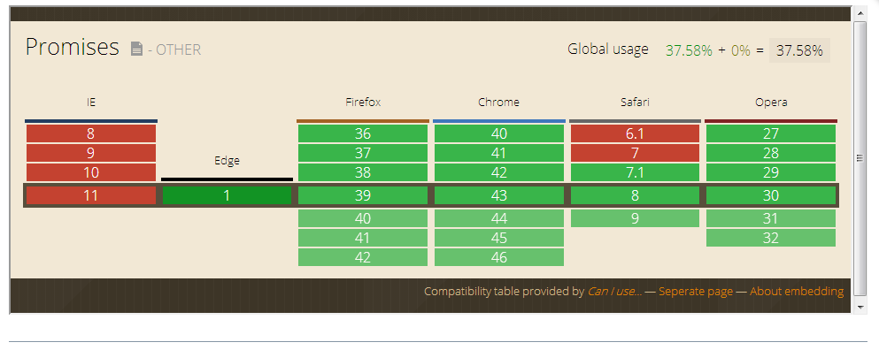

# 前言

## 写作初衷

本书的目的是以目前还在制定中的 [ECMAScript 6 Promises](http://liubin.github.io/promises-book/#es6-promises) 规范为中心，着重向各位读者介绍 JavaScript 中对 Promise 相关技术的支持情况。

通过阅读本书，我们希望各位读者能在下面三个目标上有所收获。

- 学习 Promise 相关内容，能熟练使用 Promise 模式并进行测试
- 学习 Promise 适合什么、不适合什么，知道 Promise 不是万能的，不能什么都想用 Promise 来解决
- 以 ES6 Promises 为基础进行学习，逐渐发展形成自己的风格

像上面所提到的那样，本书主要是以 [ES6 Promises](http://liubin.github.io/promises-book/#es6-promises)，即 JavaScript 的标准规范为基础的、Promise 的相关知识为主要讲解内容。

在 Firefox 和 Chrome 这样技术比较超前的浏览器上，不需要安装额外的插件就能使用 Promise 功能，此外 ES6 Promises 的规范来源于 [Promises/A+](http://liubin.github.io/promises-book/#promises-aplus) 社区，它有很多版本的实现。

我们将会从基础 API 开始介绍可以在浏览器的原生支持或者通过插件支持的 Promise 功能。 也希望各位读者能了解这其中 Promise 适合干什么，不适合干什么，能根据实际需求选择合适的技术实现方案。

## 开始阅读之前

本书的阅读对象需要对 JavaScript 有基本的了解和知识。

- [JavaScript: The Good Parts](http://shop.oreilly.com/product/9780596517748.do)
- [JavaScript Patterns](http://shop.oreilly.com/product/9780596806767.do)
- [JavaScript: The Definitive Guide, 6th Edition](http://shop.oreilly.com/product/9780596805531.do)
- [Perfect JavaScript（日文版）](http://gihyo.jp/book/2011/978-4-7741-4813-7?ard=1400715177)
- [Effective JavaScript（日文版）](http://books.shoeisha.co.jp/book/b107881.html)

如果你读过上面的其中一本的话，就应该非常容易理解本书的内容了。

另外如果你有使用 JavaScript 编写 Web 应用程序的经验，或者使用 Node.js 编写过命令行、服务器端程序的话，那么你可能会对本文中的一些内容感到非常熟悉。

本书的一本分章节将会以 Node.js 环境为背景进行说明，如果你有 Node.js 基础的话，那么一定会非常容易理解这部分内容了。

## 格式约定

- 关于 Promise 的术语请参考术语集。
 - 一般一个名词第一次出现时都会附带相关链接。
- 实例方法都用 instance#method 的形式。
 - 比如 `Promise#then` 这种写法表示的是 Promise 的实例对象的 `then` 这一方法。
- 对象方法都采用 object.method 的形式。
 - 这沿用了 JavaScript 中的使用方式，`Promise.all` 表示的是一个静态方法。

   > 这部分内容主要讲述的是对正文部分的补充说明。

## 推荐浏览器

我们推荐使用内置对 Promise 支持的浏览器来阅读本书。

Firefox 和 Chrome 的话都支持 [ES6 Promises](http://liubin.github.io/promises-book/#es6-promises) 标准。

此外，虽然不是推荐的阅读环境，但是读者还是能在 iOS 等移动终端上阅读本书。



## 运行示例代码

本网站使用了 Promise 的 [Polyfill 类库](http://liubin.github.io/promises-book/#promise-polyfill)，因此即使在不支持 Promise 的浏览器上也能执行示例代码。

此外像下面这样，各位读者可以通过运行按钮来运行可执行的示例代码。

```

    var promise = new Promise(function(resolve){
        resolve(42);
    });
    promise.then(function(value){
        console.log(value);
    }).catch(function(error){
        console.error(error);
    });

```

如果你对哪里有疑问的话，都可以现场修改代码并执行，以加深对该部分代码的理解。

## 本书源代码/License

本书中示例代码都可以在 GitHub 上找到。

本书采用 [AsciiDoc](http://asciidoctor.org/) 格式编写。

- [azu/promises-book](https://github.com/azu/promises-book)

此外代码仓库中还包含本书示例代码的测试代码。

源代码的许可证为 MIT 许可证，文章内容可以基于 CC-BY-NC 使用。

## 意见和疑问

如果有意见或者问题的话，可以直接在 GitHub 上提 Issue 即可。
 
- [Issues · azu/promises-book 日文版](https://github.com/azu/promises-book/issues?state=open)
- [Issues · liubin/promises-book 中文版](https://github.com/liubin/promises-book/issues?state=open)

此外，你也可以在 [在线聊天](https://gitter.im/azu/promises-book) 上留言。

各位读者除了能免费阅读本书，也有编辑本书的权利。你可以在 GitHub 上通过 [Pull Requests](https://github.com/azu/promises-book/pulls) 来贡献自己的工作。

