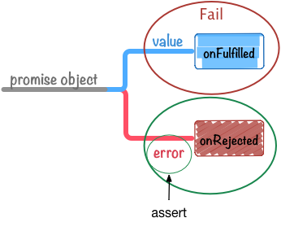

# 3. Chapter.3 - Promise 测试

这章我们学习如果编写 Promise 的测试代码

## 3.1. 基本测试

关于 [ES6 Promises](http://liubin.github.io/promises-book/#es6-promises) 的语法我们已经学了一些， 我想大家应该也能够在实际项目中编写 Promise 的 Demo 代码了吧。

这时，接下来你可能要苦恼该如何编写 Promise 的测试代码了。

那么让我们先来学习下如何使用 [Mocha](http://mochajs.org/) 来对 Promise 进行基本的测试吧。

先声明一下，这章中涉及的测试代码都是运行在 Node.js 环境下的。

> 本书中出现的示例代码也都有相应的测试代码。 测试代码可以参考 [azu/promises-book](https://github.com/azu/promises-book) 。

### 3.1.1. Mocha

Mocha 是 Node.js 下的测试框架工具,在这里，我们并不打算对 Mocha[http://mochajs.org/](http://mochajs.org/) 本身进行详细讲解。对  [Mocha](http://mochajs.org/) 感兴趣的读者可以自行学习。

Mocha可以自由选择 BDD、TDD、exports 中的任意风格，测试中用到的 Assert 方法也同样可以跟任何其他类库组合使用。 也就是说，Mocha 本身只提供执行测试时的框架，而其他部分则由使用者自己选择。

这里我们选择使用 Mocha，主要基于下面 3 点理由。

- 它是非常著名的测试框架
- 支持基于 Node.js 和浏览器的测试
- 支持"Promise测试"

最后至于为什么说 支持"Promise测试" ，这个我们在后面再讲。

要想在本章中使用 Mocha，我们需要先通过 npm 来安装 Mocha。

```

   $ npm install -g mocha

```

另外，Assert 库我们使用的是 Node.js 自带的 `assert` 模块，所以不需要额外安装。

首先，让我们试着编写一个对传统回调风格的异步函数进行测试的代码。

### 3.1.2. 回调函数风格的测试

如果想使用回调函数风格来对一个异步处理进行测试，使用 Mocha 的话代码如下所示。

```

    var assert = require('power-assert');
    describe('Basic Test', function () {
    context('When Callback(high-order function)', function () {
    it('should use `done` for test', function (done) {
    setTimeout(function () {
    assert(true);
    done();
    }, 0);
    });
    });
    context('When promise object', function () {
    it('should use `done` for test?', function (done) {
    var promise = Promise.resolve(1);
    // このテストコードはある欠陥があります
    promise.then(function (value) {
    assert(value === 1);
    done();
    });
    });
    });
    });

```

将这段代码保存为 `basic-test.js`，之后就可以使用刚才安装的 Mocha 的命令行工具进行测试了。

```

    $ mocha basic-test.js

```

Mocha 的 `it` 方法指定了 `done` 参数，在 `done()` 函数被执行之前， 该测试一直处于等待状态，这样就可以对异步处理进行测试。

Mocha 中的异步测试，将会按照下面的步骤执行。

```

    it("should use `done` for test", function (done) {
    <1>
        setTimeout(function () {
            assert(true);
            done();<2>
        }, 0);
    });

```

<1> 回调式的异步处理  
<2> 调用 `one` 后测试结束

这也是一种非常常见的实现方式。

### 3.1.3. 使用 `done` 的 Promise 测试

接下来，让我们看看如何使用 `done` 来进行 Promise 测试。

```

    it("should use `done` for test?", function (done) {
         var promise = Promise.resolve(42);<1>
        promise.then(function (value) {
            assert(value === 42);<2>
            done();
        });
    });

```

<1>创建名为 `Fulfilled` 的 promise 对象  
<2>调用 `done` 后测试结束

`Promise.resolve` 用来返回 promise 对象， 返回的 promise 对象状态为 FulFilled。 最后，通过 `.then` 设置的回调函数也会被调用。

像[专栏: Promise 只能进行异步操作？](http://liubin.github.io/promises-book/#promise-is-always-async) 中已经提到的那样， promise 对象的调用总是异步进行的，所以测试也同样需要以异步调用的方式来编写。

但是，在前面的测试代码中，在 `assert` 失败的情况下就会出现问题。

**对异常promise测试**


```

    it("should use `done` for test?", function (done) {
       var promise = Promise.resolve();
        promise.then(function (value) {
            assert(false);// => throw AssertionError
            done();
        });
    });

```

在此次测试中 `assert` 失败了，所以你可能认为应该抛出“测试失败”的错误， 而实际情况却是测试并不会结束，直到超时。


Figure 7. 由于测试不会结束，所以直到发生超时时间未知，一直会处于挂起状态。

通常情况下，`assert` 失败的时候，会 throw 一个 error， 测试框架会捕获该 error，来判断测试失败。

但是，Promise 的情况下 `.then` 绑定的函数执行时发生的 error 会被 Promise 捕获，而测试框架则对此 error 将会一无所知。

我们来改善一下 `assert` [失败的 promise 测试](http://liubin.github.io/promises-book/#promise-assert-fail)， 让它能正确处理 `assert` 失败时的测试结果。

**测试正常失败的示例**


```

    it("should use `done` for test?", function (done) {
        var promise = Promise.resolve();
        promise.then(function (value) {
            assert(false);
        }).then(done, done);
    });

```

在上面测试正常失败的示例中，为了确保 `done` 一定会被调用， 我们在最后添加了 `.then(done, done);` 语句。

`assert` 测试通过（成功）时会调用 `done()` ，而 `assert` 失败时则调用 `done(error)` 。

这样，我们就编写出了和 [回调函数风格的测试](http://liubin.github.io/promises-book/#callback-style-test) 相同的 Promise 测试。

但是，为了处理 `assert` 失败的情况，我们需要额外添加 `.then(done, done)`; 的代码。 这就要求我们在编写 Promise 测试时要格外小心，忘了加上上面语句的话，很可能就会写出一个永远不会返回直到超时的测试代码。

在下一节，让我们接着学习一下最初提到的使用 Mocha 理由中的支持" Promises 测试"究竟是一种什么机制。

## 3.2. Mocha 对 Promise 的支持

在这里，我们将会学习什么是 Mocha 支持的“对 Promise 测试”。

官方网站 [Asynchronous code](http://mochajs.org/#asynchronous-code) 也记载了关于 Promise 测试的概要。

> Alternately, instead of using the done() callback, you can return a promise. This is useful if the APIs you are testing return promises instead of taking callbacks:

这段话的意思是，在对 Promise 进行测试的时候，不使用 `done()` 这样的回调风格的代码编写方式，而是返回一个 promise 对象。

那么实际上代码将会是什么样的呢？这里我们来看个具体的例子应该容易理解了。

```

    var assert = require('power-assert');
    describe('Promise Test', function () {
        it('should return a promise object', function () {
            var promise = Promise.resolve(1);
            return promise.then(function (value) {
                assert(value === 1);
            });
        });
    });

```

这段代码将前面 [前面使用 `done` 的例子](http://liubin.github.io/promises-book/#promise-assert-fail-fixed) 按照 Mocha 的 Promise 测试方式进行了重写。

修改的地方主要在以下两点：

- 删除了 `done`
- 返回结果为 promise 对象

采用这种写法的话，当 `assert` 失败的时候，测试本身自然也会失败。

```

    t("should be fail", function () {
        return Promise.resolve().then(function () {
            assert(false);// => 测试失败
        });
    });

```

采用这种方法，就能从根本上省略诸如 `.then(done, done)`; 这样本质上跟测试逻辑并无直接关系的代码。

> Mocha 已经支持对 Promises 的测试 | Web scratch 这篇（日语）文章里也提到了关于 Mocha 对 Promise 测试的支持。

###3.2.1. 意料之外（失败的）的测试结果

因为 Mocha 提供了对 Promise 的测试，所以我们会认为按照 Mocha 的规则来写会比较好。 但是这种代码可能会带来意想不到的异常情况的发生。

比如对下面的 `mayBeRejected()` 函数的测试代码，该函数返回一个当满足某一条件就变为 Rejected 的 promise 对象。

```

    function mayBeRejected(){ <1>
        return Promise.reject(new Error("woo"));
    }
    it("is bad pattern", function () {
        return mayBeRejected().catch(function (error) {
            assert(error.message === "woo");
        });
    });

```

<1>	这个函数用来对返回的 promise 对象进行测试

这个测试的目的包括以下两点：

`mayBeRejected()` **返回的 promise 对象如果变为 FulFilled 状态的话**
测试将会失败

`mayBeRejected()` **返回的promise 对象如果变为 Rejected 状态的话**
在 `assert` 中对 Error 对象进行检查

上面的测试代码，当 promise 对象变为 Rejected 的时候，会调用在 `onRejected` 中注册的函数，从而没有走正 promise 的处理常流程，测试会成功。

这段测试代码的问题在于当 `mayBeRejected()` 返回的是一个 **为 FulFilled 状态的 promise 对象时**，测试会一直成功。

```

    function mayBeRejected(){ <1>
        return Promise.resolve();
    }
    it("is bad pattern", function () {
        return mayBeRejected().catch(function (error) {
            assert(error.message === "woo");
        });
    });

```

<1> 返回的 promise 对象会变为 FulFilled

在这种情况下，由于在 `catch` 中注册的 `onRejected` 函数并不会被调用，因此 `assert` 也不会被执行，测试会一直通过（passed，成功）。

为了解决这个问题，我们可以在 `.catch` 的前面加入一个 `.then` 调用，可以理解为如果调用了 `.then` 的话，那么测试就需要失败

```

    function failTest() { <1>
        throw new Error("Expected promise to be rejected but it was fulfilled");
    }
    function mayBeRejected(){
        return Promise.resolve();
    }
    it("should bad pattern", function () {
        return mayBeRejected().then(failTest).catch(function (error) {
            assert.deepEqual(error.message === "woo");
        });
    });

```


<1>通过 throw 来使测试失败


但是，这种写法会像在前面 [then or catch](http://liubin.github.io/promises-book/#then-or-catch)? 中已经介绍的一样， `failTest` 抛出的异常会被 `catch` 捕获。


Figure 8. Then Catch flow

程序的执行流程为 `then` → `catch`，传递给 `catch` 的 Error 对象为 `AssertionError` 类型 ， 这并不是我们想要的东西。

也就是说，我们希望测试**只能**通过状态会变为 onRejected 的 promise 对象， 如果 promise 对象状态为 onFulfilled 状态的话，那么该测试就会一直通过。

### 3.2.2. 明确两种状态，改善测试中的意外（异常）状况

在编写 [上面对 Error 对象进行测试的例子](http://liubin.github.io/promises-book/#mocha-rejected-promise-test) 时， 怎么才能剔除那些会意外通过测试的情况呢？

最简单的方式就是像下面这样，在测试代码中判断在各种 promise 对象的状态下，应进行如何的操作。

**变为 FulFilled 状态的时候**
测试会预期失败

**变为 Rejected 状态的时候**
使用 `assert` 进行测试

也就是说，我们需要在测试代码中明确指定在Fulfilled和Rejected这两种状态下，都需进行什么样的处理。

```

    function mayBeRejected() {
        return Promise.resolve();
    }
    it("catch -> then", function () {
        // 变为FulFilled的时候测试失败
        return mayBeRejected().then(failTest, function (error) {
            assert(error.message === "woo");
        });
    });

```

像这样的话，就能在 promise 变为 FulFilled 的时候编写出失败用的测试代码了。


Figure 9. Promise onRejected test

在 [then or catch?](http://liubin.github.io/promises-book/#then-or-catch) 中我们已经讲过，为了避免遗漏对错误的处理， 与使用 `.then(onFulfilled, onRejected)` 这样带有二个参数的调用形式相比， 我们更推荐使用 `then` → `catch` 这样的处理方式。

但是在编写测试代码的时候，Promise 强大的错误处理机制反而成了限制我们的障碍。 因此我们不得已采取了 `.then(failTest, onRejected)` 这种写法，明确指定 promise 在各种状态下进行何种的处理。

### 3.2.3. 总结
在本小节中我们对在使用 Mocha 进行 Promise 测试时可能出现的一些意外情况进行了介绍。

- 普通的代码采用 `then` → `catch` 的流程的话比较容易理解  
 - 这是为了错误处理的方便。请参考 [then or catch?](http://liubin.github.io/promises-book/#then-or-catch)

- 将测试代码集中到 `then` 中处理  
 - 为了能将 AssertionError 对象传递到测试框架中。

通过使用 `.then(onFulfilled, onRejected)` 这种形式的写法， 我们可以明确指定 promise 对象在变为 Fulfilled 或 Rejected 时如何进行处理。

但是，由于需要显示的指定 Rejected 时的测试处理， 像下面这样的代码看起来总是有一些让人感到不太直观的感觉。

```

    promise.then(failTest, function(error){
    // 使用assert对error进行测试
    });

```

在下一小节，我们会介绍如何编写 helper 函数以方便编写 Promise 的测试代码， 以及怎样去编写更容易理解的测试代码。

## 3.3. 编写可控测试（controllable tests）

在继续进行说明之前，我们先来定义一下什么是可控测试。在这里我们对可控测试的定义如下。

待测试的 promise 对象

- 如果编写预期为 Fulfilled 状态的测试的话
 - Rejected 的时候要 **Fail**
 - assertion 的结果不一致的时候要 **Fail**

- 如果预期为 Rejected 状态的话
 - 结果为 Fulfilled 测试为 Fail
 - assertion 的结果不一致的时候要 **Fail**

如果一个测试能网罗上面的用例（Fail）项，那么我们就称其为可控测试。

也就是说，一个测试用例应该包括下面的测试内容。

- 结果满足 Fulfilled or Rejected 之一
- 对传递给 assertion 的值进行检查

在前面使用了 `.then` 的代码就是一个期望结果为 Rejected 的测试。

```

    promise.then(failTest, function(error){
        // 通过assert验证error对象
        assert(error instanceof Error);
    });

```

### 3.3.1. 必须明确指定转换后的状态

为了编写有效的测试代码， 我们需要明确指定 [promise 的状态](http://liubin.github.io/promises-book/#promise-states) 为 Fulfilled or Rejected 的两者之一。

但是由于 `.then` 的话在调用的时候可以省略参数，有时候可能会忘记加入使测试失败的条件。

因此，我们可以定义一个 helper 函数，用来明确定义 promise 期望的状态。

> 笔者（原著者）创建了一个类库 [azu/promise-test-helper](https://github.com/azu/promise-test-helper) 以方便对 Promise 进行测试，本文中使用的是这个类库的简略版

首先我们创建一个名为 `shouldRejected` 的 helper 函数，用来在刚才的 `.then` 的例子中，期待测试返回状态为 onRejected 的结果的例子。

```

    var assert = require('power-assert');
    function shouldRejected(promise) {
    return {
    'catch': function (fn) {
    return promise.then(function () {
    throw new Error('Expected promise to be rejected but it was fulfilled');
    }, function (reason) {
    fn.call(promise, reason);
    });
    }
    };
    }
    it('should be rejected', function () {
    var promise = Promise.reject(new Error('human error'));
    return shouldRejected(promise).catch(function (error) {
    assert(error.message === 'human error');
    });
    });

```

`shouldRejected` 函数接收一个 promise 对象作为参数，并且返回一个带有 `catch` 方法的对象。

在这个 `catch` 中可以使用和 onRejected 里一样的代码，因此我们可以在 `catch` 使用基于 assertion 方法的测试代码。

在 `shouldRejected` 外部，都是类似如下、和普通的 promise 处理大同小异的代码。

1. 将需要测试的 promise 对象传递给 `shouldRejected` 方法
2. 在返回的对象的 `catch` 方法中编写进行 onRejected 处理的代码
3. 在 onRejected 里使用 assertion 进行判断

在使用 `shouldRejected` 函数的时候，如果是 Fulfilled 被调用了的话，则会 throw 一个异常，测试也会失败。

```

    promise.then(failTest, function(error){
        assert(error.message === 'human error');
    });
        // == 几乎这两段代码是同样的意思
    shouldRejected(promise).catch(function (error) {
        assert(error.message === 'human error');
    });

```

使用 `shouldRejected` 这样的 helper 函数，测试代码也会变得很直观。



Figure 10. Promise onRejected test

像上面一样，我们也可以编写一个测试 promise 对象期待结果为 Fulfilled 的 `shouldFulfilled` helper 函数。

```

    var assert = require('power-assert');
    function shouldFulfilled(promise) {
    return {
    'then': function (fn) {
    return promise.then(function (value) {
    fn.call(promise, value);
    }, function (reason) {
    throw reason;
    });
    }
    };
    }
    it('should be fulfilled', function () {
    var promise = Promise.resolve('value');
    return shouldFulfilled(promise).then(function (value) {
    assert(value === 'value');
    });
    });
    
```

这和上面的 [shouldRejected-test.js](http://liubin.github.io/promises-book/#shouldRejected-test.js) 结构基本相同，只不过返回对象的 `catch` 方法变为了 `then` ，promise.then 的两个参数也调换了。

### 3.3.2. 小结
在本小节我们学习了如何编写针对 Promise 特定状态的测试代码，以及如何使用便于测试的 helper 函数。

> 这里我们使用到的 `shouldFulfilled` 和 `shouldRejected` 也可以在下面的类库中找到。
[azu/promise-test-helper。
    ](https://github.com/azu/promise-test-helper)
    
此外，本小节中的 helper 方法都是以 [Mocha 对 Promise 的支持](http://liubin.github.io/promises-book/#mocha-promise) 为前提的， 在 [基于 done 的测试](http://liubin.github.io/promises-book/#done-promise-test) 中使用的话可能会比较麻烦。

是使用基于测试框架对 Promis 的支持，还是使用基于类似 `done` 这样回调风格的测试方式，每个人都可以自由的选择，只是风格问题，我觉得倒没必要去争一个孰优孰劣。

比如在 [CoffeeScript](http://coffeescript.org/) 下进行测试的话，由于 CoffeeScript 会隐式的使用 return 返回，所以使用 `done` 的话可能更容易理解一些。

对 Promise 进行测试比对通常的异步函数进行测试坑更多，虽说采取什么样的测试方法是个人的自由，但是在同一项目中采取前后风格一致的测试则是非常重要。 

  


