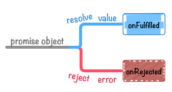

# 1. Chapter.1 - 什么是 Promise

本章将主要对 JavaScript 中的 Promise 进行入门级的介绍。

## 1.1. 什么是 Promise

首先让我们来了解一下到底什么是 Promise。

Promise 是抽象异步处理对象以及对其进行各种操作的组件。 其详细内容在接下来我们还会进行介绍，Promise 并不是从 JavaScript 中发祥的概念。

Promise 最初被提出是在 [E 语言](http://erights.org/elib/distrib/pipeline.html)中， 它是基于并列/并行处理设计的一种编程语言。

现在 JavaScript 也拥有了这种特性，这就是本书所介绍的 JavaScript Promise。

另外，如果说到基于 JavaScript 的异步处理，我想大多数都会想到利用回调函数。

```

    使用了回调函数的异步处理
    ----
    getAsync("fileA.txt", function(error, result){
        if(error){// 取得失败时的处理
            throw error;
        }
        // 取得成功时的处理
    });
    ----
    <1> 传给回调函数的参数为(error对象， 执行结果)组合

```

Node.js 等则规定在 JavaScript 的回调函数的第一个参数为 Error 对象，这也是它的一个惯例。

像上面这样基于回调函数的异步处理如果统一参数使用规则的话，写法也会很明了。 但是，这也仅是编码规约而已，即使采用不同的写法也不会出错。

而 Promise 则是把类似的异步处理对象和处理规则进行规范化， 并按照采用统一的接口来编写，而采取规定方法之外的写法都会出错。

```

    下面是使用了Promise进行异步处理的一个例子
    ----
    var promise = getAsyncPromise("fileA.txt"); (1)
    promise.then(function(result){
        // 获取文件内容成功时的处理
    }).catch(function(error){
        // 获取文件内容失败时的处理
    });
    ----
    <1> 返回promise对象

```

我们可以向这个预设了抽象化异步处理的 promise 对象， 注册这个 promise 对象执行成功时和失败时相应的回调函数。

这和回调函数方式相比有哪些不同之处呢？ 在使用 promise 进行一步处理的时候，我们必须按照接口规定的方法编写处理代码。

也就是说，除 promise 对象规定的方法(这里的 `then` 或 `catch`)以外的方法都是不可以使用的， 而不会像回调函数方式那样可以自己自由的定义回调函数的参数，而必须严格遵守固定、统一的编程方式来编写代码。

这样，基于 Promise 的统一接口的做法， 就可以形成基于接口的各种各样的异步处理模式。

所以，promise 的功能是可以将复杂的异步处理轻松地进行模式化， 这也可以说得上是使用 promise 的理由之一。

接下来，让我们在实践中来学习 JavaScript 的 Promise 吧。

## 1.2. Promise 简介

在 [ES6 Promises](http://liubin.github.io/promises-book/#es6-promises) 标准中定义的 API 还不是很多。

目前大致有下面三种类型。

**Constructor**

Promise 类似于 `XMLHttpRequest`，从构造函数 `Promise` 来创建一个新建新 `promise` 对象作为接口。

要想创建一个 promise 对象、可以使用 `new` 来调用 `Promise` 的构造器来进行实例化。

```

    var promise = new Promise(function(resolve, reject) {
        // 异步处理
        // 处理结束后、调用resolve 或 reject
    });

```
**Instance Method**

对通过 new 生成的 promise 对象为了设置其值在 **resolve**(成功) / **reject**(失败)时调用的回调函数 可以使用 `promise.then()` 实例方法。

```

    promise.then(onFulfilled, onRejected)

```

**resolve(成功)时**
`onFulfilled` 会被调用

**reject(失败)时**
`onRejected` 会被调用

`onFulfilled`、`onRejected` 两个都为可选参数。

`promise.then` 成功和失败时都可以使用。 另外在只想对异常进行处理时可以采用 `promise.then(undefined, onRejected)` 这种方式，只指定 reject 时的回调函数即可。 不过这种情况下 `promise.catch(onRejected)` 应该是个更好的选择。

```

    promise.catch(onRejected)

```

**Static Method**

像 `Promise` 这样的全局对象还拥有一些静态方法。

包括 `Promise.all()` 还有 `Promise.resolve()` 等在内，主要都是一些对 Promise 进行操作的辅助方法。

### 1.2.1. Promise workflow

我们先来看一看下面的示例代码。

```

    function asyncFunction() {
    
        return new Promise(function (resolve, reject) {
            setTimeout(function () {
                resolve('Async Hello world');
            }, 16);
        });
    }

    asyncFunction().then(function (value) {
        console.log(value);    // => 'Async Hello world'
    }).catch(function (error) {
        console.log(error);
    });

```

`asyncFunction` 这个函数会返回 promise 对象，对于这个 promise 对象，我们调用它的 `then` 方法来设置resolve后的回调函数，`catch` 方法来设置发生错误时的回调函数。

该 promise 对象会在 setTimeout 之后的 16 ms 时被 resolve,
这时 `then` 的回调函数会被调用，并输出 `'Async Hello world'` 。

在这种情况下 `catch` 的回调函数并不会被执行（因为 promise 返回了 resolve），不过如果运行环境没有提供 `setTimeout` 函数的话，那么上面代码在执行中就会产生异常，在 `catch` 中设置的回调函数就会被执行。

当然，像`promise.then(onFulfilled, onRejected)` 的方法声明一样，
如果不使用`catch` 方法只使用 `then`方法的话，如下所示的代码也能完成相同的工作。

```

    asyncFunction().then(function (value) {
        console.log(value);
    }, function (error) {
        console.log(error);
    });

```

### 1.2.2. Promise 的状态

我们已经大概了解了 Promise 的处理流程，接下来让我们来稍微整理一下 Promise 的状态。

用 `new Promise` 实例化的 promise 对象有以下三个状态。

**"has-resolution" - Fulfilled::**  
   resolve(成功)时。此时会调用  `onFulfilled` 
 
**"has-rejection"  - Rejected::**  
   reject(失败)时。此时会调用  `onRejected`
  
**"unresolved" - Pending::**  
   既不是 resolve 也不是 reject 的状态。也就是 promise 对象刚被创建后的初始化状态等

关于上面这三种状态的读法，其中 左侧为在 [ES6 Promises](http://liubin.github.io/promises-book/#es6-promises) 规范中定义的术语， 而右侧则是在 [Promises/A+](http://liubin.github.io/promises-book/#promises-aplus) 中描述状态的术语。

基本上状态在代码中是不会涉及到的，所以名称也无需太在意。 在这本书中，我们会基于 [Promises/A+](v) 中 Pending 、 Fulfilled 、 Rejected 的状态名称进行讲述。


**Figure 1. promise states**

> 在 [ECMAScript Language Specification ECMA-262 6th Edition – DRAFT](http://people.mozilla.org/~jorendorff/es6-draft.html#sec-promise-objects) 中 `[[PromiseStatus]]` 都是在内部定义的状态。
由于没有公开的访问 `[[PromiseStatus]]` 的用户 API，所以暂时还没有查询其内部状态的方法。

到此在本文中我们已经介绍了 promise 所有的三种状态。

promise 对象的状态，从 *Pending* 转换为 *Fulfilled* 或 *Rejected* 之后，这个 promise 对象的状态就不会再发生任何变化。

也就是说，Promise 与 Event 等不同，在 `.then` 后执行的函数可以肯定地说只会被调用一次。

另外，*Fulfilled* 和 *Rejected* 这两个中的任一状态都可以表示为 **Settled**(不变的)。

**Settled::**  
    resolve(成功) 或 reject(失败)。

从__Pending__和__Settled__的对称关系来看，Promise 状态的种类/迁移是非常简单易懂的。

当 promise 的对象状态发生变化时，用 `.then` 来定义只会被调用一次的函数。

> [JavaScript Promises - Thinking Sync in an Async World // Speaker Deck](https://speakerdeck.com/kerrick/javascript-promises-thinking-sync-in-an-async-world) 这个 ppt 中有关于 Promise 状态迁移的非常容易理解的说明。

## 1.3. 编写 Promise 代码

这里我们来介绍一下如何编写Promise代码。

### 1.3.1. 创建 promise 对象

创建 promise 对象的流程如下所示。

- `new Promise(fn)` 返回一个promise对象
- 在 `fn` 中指定异步等处理
 - 处理结果正常的话，调用 `resolve(处理结果值)` 
 - 处理结果错误的话，调用 `reject(Error对象)` 

按这个流程我们来实际编写下 promise 代码吧。

我们的任务是用 Promise 来通过异步处理方式来获取 XMLHttpRequest(XHR) 的数据。

**创建 XHR 的 promise 对象**

首先，创建一个用 Promise 把 XHR 处理包装起来的名为 getURL 的函数

```

    function getURL(URL) {
          return new Promise(function (resolve, reject) {
           var req = new XMLHttpRequest();
            req.open('GET', URL, true);
            req.onload = function () {
                if (req.status === 200) {
                     resolve(req.responseText);
                } else {
                    reject(new Error(req.statusText));
                }
            };
            req.onerror = function () {
                reject(new Error(req.statusText));
            };
            req.send();
        });
    }

```

`getURL` 只有在通过 XHR 取得结果状态为 200 时才会调用 `resolve` - 也就是只有数据取得成功时，而其他情况（取得失败）时则会调用 `reject` 方法。


`resolve(req.responseText)` 在 response 的内容中加入了参数。resolve 方法的参数并没有特别的规则，基本上把要传给回调函数参数放进去就可以了。( `then` 方法可以接收到这个参数值)

熟悉 Node.js 的人，经常会在写回调函数时将  `callback(error, response)`  的第一个参数设为 error 对象，而在 Promise 中 resolve/reject 则担当了这个职责（处理正常和异常的情况），所以在 resolve 方法中只传一个 response 参数是没有问题的。

接下来我们来看一下 `reject` 函数。

XHR 中 `onerror` 事件被触发的时候就是发生错误时，所以理所当然调用 `reject`。
这里我们重点来看一下传给 `reject` 的值。

发生错误时要像这样 `reject(new Error(req.statusText));` ，创建一个 Error 对象后再将具体的值传进去。传给 `reject` 的参数也没有什么特殊的限制，一般只要是 Error 对象（或者继承自 Error 对象）就可以。

传给 `reject` 的参数，其中一般是包含了 reject 原因的 Error 对象。本次因为状态值不等于 200 而被 reject，所以 `reject` 中放入的是 statusText。（这个参数的值可以被 `then` 方法的第二个参数或者 `catch` 方法中使用）

### 1.3.2. 编写 promise 对象处理方法

让我们在实际中使用一下刚才创建的返回 promise 对象的函数

```

    getURL("http://example.com/"); // => 返回promise对象
    
```

如 [Promises Overview](http://liubin.github.io/promises-book/#promises-overview) 中做的简单介绍一样，promise 对象拥有几个实例方法， 我们使用这些实例方法来为 promise 对象创建依赖于 promise 的具体状态、并且只会被执行一次的回调函数。

为 promise 对象添加处理方法主要有以下两种

- promise对象被 **resolve** 时的处理(onFulfilled)
- promise对象被 **reject** 时的处理(onRejected)



**Figure 2. promise value flow**

首先，我们来尝试一下为 `getURL` 通信成功并取到值时添加的处理函数。

此时所谓的 _通信成功_ ，指的就是在被 resolve 后， _promise 对象变为 FulFilled 状态_ 。

被 **resolve** 后的处理，可以在 `.then` 方法中传入想要调用的函数。

```

    var URL = "http://httpbin.org/get";
    getURL(URL).then(function onFulfilled(value){ 
        console.log(value);
    });

```

<1> 为了方便理解我们把函数命名为 `onFulfilled` [getURL函数](http://liubin.github.io/promises-book/#xhr-promise.js) 中的 `resolve(req.responseText);` 会将 promise 对象变为 resolve（Fulfilled）状态，
同时使用其值调用 `onFulfilled` 函数。

不过目前我们还没有对其中可能发生的错误做任何处理，接下来，我们就来为 `getURL` 函数添加发生错误时的异常处理。

此时 _发生错误_ ，指的也就是 reject 后 _promise 对象变为 Rejected 状态_ 。

被 **reject** 后的处理，可以在`.then` [的第二个参数](http://liubin.github.io/promises-book/#promise.then)或者是在 [`.catch`](http://liubin.github.io/promises-book/#promise.catch) 方法中设置想要调用的函数。

把下面 reject 时的处理加入到刚才的代码，如下所示。

```

    var URL = "http://httpbin.org/status/500"; 
    getURL(URL).then(function onFulfilled(value){
        console.log(value);
    }).catch(function onRejected(error){ 
        console.error(error);
    });

```

<1> 服务端返回的状态码为 500  
<2> 为了方便理解函数被命名为 `onRejected`

在 `getURL` 的处理中发生任何异常，或者被明确 reject 的情况下，
该异常原因（Error 对象）会作为 [`.catch`](http://liubin.github.io/promises-book/#promise.catch) 方法的参数被调用。

其实 [.catch](http://liubin.github.io/promises-book/#promise.catch) 的别名而已， 如下代码也可以完成同样的功能。)只是 `promise.then(undefined, onRejected)` 的别名而已， 如下代码也可以完成同样的功能。

```

getURL(URL).then(onFulfilled, onRejected);<1>


```
<1> onFulfilled, onRejected 是和刚才相同的函数

一般说来，使用[.catch](http://liubin.github.io/promises-book/#promise.catch)来将 resolve 和 reject 处理分开来写是比较推荐的做法， 这两者的区别会在 then 和 catch 的区别中再做详细介绍。

**总结**

在本章我们简单介绍了以下内容：

- 用 `new Promise` 方法创建 promise 对象
- 用 `.then` 或 `.catch` 添加 promise 对象的处理函数

到此为止我们已经学习了 Promise 的基本写法。 其他很多处理都是由此基本语法延伸的，也使用了 Promise 提供的一些静态方法来实现。

实际上即使使用回调方式的写法也能完成上面同样的工作，而使用 Promise 方式的话有什么优点么？在本小节中我们没有讲到两者的对比及 Promise 的优点。在接下来的章节中，我们将会对 Promise 优点之一，即错误处理机制进行介绍，以及和传统的回调方式的对比。


    


    

    


  